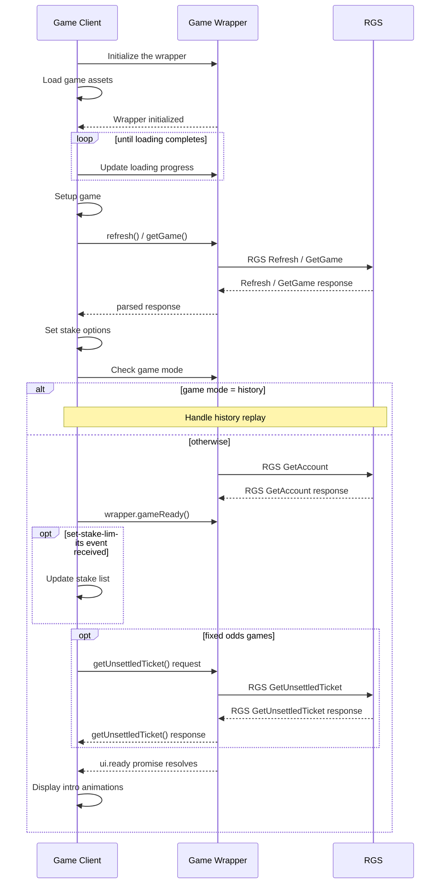
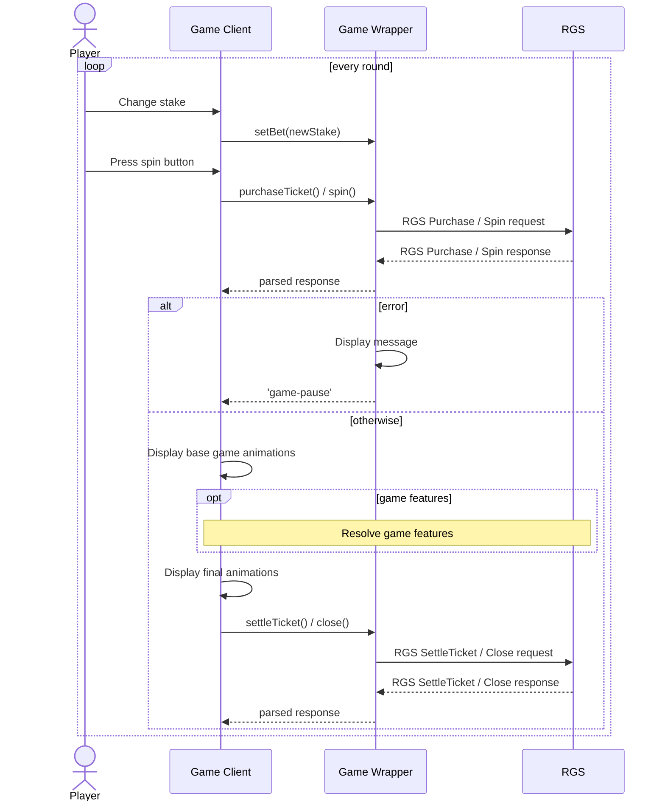
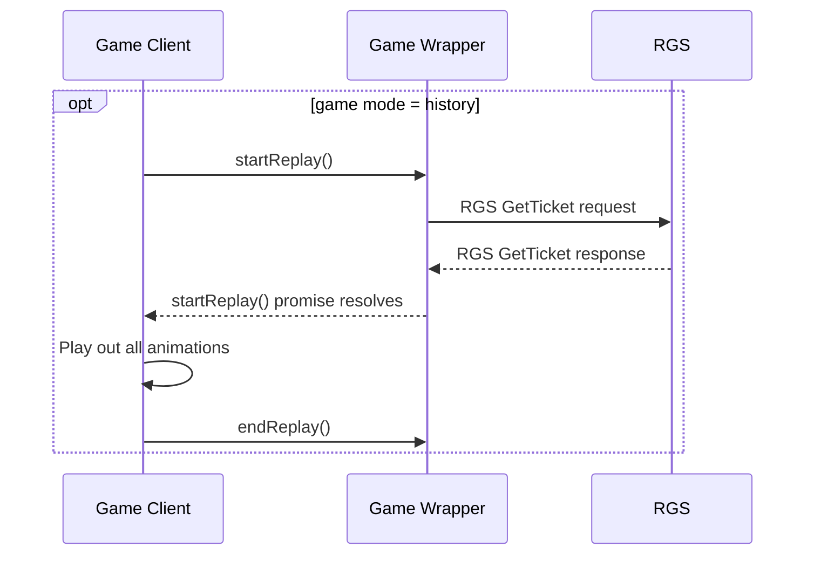

# GameWrapper Usage Guide

## Overview

GameWrapper is a library which provides a standardized UI and a set of tools for developing games that work with the RGS.

The wrapper exposes multiple features to game developers:

- [**RGS API**](#rgs-api) with gamble feature support for fixed odds, slot, keno and cards games,
- [**UI**](#user-interface) - a set of standardized visual elements with an API to interact with them,
- [**Autoplay**](#autoplay) mechanism for triggering multiple consecutive purchases,
- [**Reality check**](#reality-check) handling where required by jurisdiction,
- [**Fullscreen management**](#fullscreen) on mobile devices,
- [**Currency formatting**](#currency-format).

## Getting started

### Installation

GameWrapper is published from `https://git.fincore.com/gromada-public/gamewrapper.git` and ships in several builds, or *flavours* — one per operator integration (for example `main` and `nyx`). The flavour a game needs depends on the operator it is deployed for.

**Recommended: load the wrapper unbundled.** Add the wrapper and its stylesheet to your `index.html` with plain tags, kept separate from your game bundle:

```html
<link rel="stylesheet" href="path/to/gamewrapper.css">
<script src="path/to/gamewrapper.min.js"></script> <!-- use gamewrapper.js for the debug build -->
```

Keeping the wrapper out of your game build means the flavour can be chosen at deploy time, without rebuilding the game for each operator. This is also the direction the wrapper is moving in: it will be served from a central location, so integrating it will be as simple as adding a single `<script>` tag — nothing to install or copy.

The `path/to/…` above is a placeholder. Deployments use the `b2b-`/`content-` host-prefix convention, so the assets live on the `content-` host — don't hardcode the host or hand-roll the derivation. See [Loading the wrapper and game from the CDN](#loading-the-wrapper-and-game-from-the-cdn) for a ready-made snippet that resolves it for you.

The standalone build files come from the repository (clone it, or download the [latest package](https://git.fincore.com/gromada-public/gamewrapper/-/archive/master/gamewrapper-master.zip)); a module build is also available as `gamewrapper.es.js`.

#### Bundling with the game (local development only)

For local development the wrapper can be installed as an npm package and imported into your build:

    npm install git+https://git.fincore.com/gromada-public/gamewrapper.git

```javascript
import GameWrapper from '@gromada/gamewrapper';
import '@gromada/gamewrapper/gamewrapper.css';

const wrapper = new GameWrapper();
```

> **Do not ship a bundled wrapper to production.** Bundling freezes one flavour into your game build, but each operator requires its own flavour. A game with the wrapper compiled in will run for a single operator only, and must be rebuilt and re-tested for every other one — which defeats the purpose of the wrapper. Use npm strictly for local development, and always deploy with the wrapper loaded unbundled, as shown above.

### GameWrapper class

The document assumes that the wrapper is being used through an instance of the `GameWrapper` class.

In ES6 builds the wrapper class is the default export of the '@gromada/gamewrapper' module:

    import GameWrapper from '@gromada/gamewrapper';

In legacy (IIFE) builds, the wrapper class is available as a member of the `GameWrapper` namespace:

    GameWrapper.GameWrapper

*Note:* This is different from wrapper versions before 3.0.0, where the API was available through static methods on the `GameWrapper` namespace.

#### Legacy API

The legacy API is still available in IIFE builds to allow for backwards-compatibility. Most of the methods are mirrored as static member functions of the `GameWrapper` namespace. 

Using this is deprecated and should be avoided in new wrapper integrations.

### Usage flow

#### Initializing



1. [Initialize](#initialization) the wrapper.
2. Load game assets. When the wrapper is initialized, update [loading progress](#splash-screen-progress-bar).
3. Setup game, including wrapper event listeners.
4. Perform the initial RGS call:
    - slots, keno and cards: `refresh()`,
    - fixed odds: `getGame()`.
5. Set available stakes and set the default based on the response.
6. Check [game mode](#game-modes). 
    - If set to history, handle [history replay](#history-replay).
6. Check balance ([`getAccount()`](#getaccount)).
7. Call `wrapper.gameReady()`.
8. Update stake list if ['*set-stake-limits*'](#set-stake-limits-event) event is received.
9. *Fixed odds only*: Check for [unsettled ticket](#getunsettledticket).
10. Wait for `ui.ready` to resolve.
11. Display intro animations.

#### Game flow

After initialization, wrapper-game interaction follows the loop below:



1. Player selects a stake.
    * Inform wrapper of [stake change](#setbetstake-number).
2. On button press, issue purchase ticket request.
3. Handle purchase response.
    * Display game animations (spinning, rolling, scoring, etc.), or
    * Handle [errors](#errors);
4. Execute any game features, if they are supported.
5. Handle feature responses (similar to #3).
6. Display final animations.
7. Close the ticket.

#### Unfinished game

At the end of the initialization phase, the game client may receive details of a previous game that hasn't been completed. This is known as an *unsettled*, *broken* or *unfinished* game.

In case there is an unfinished game, the game client should set it up and fast-forward to the appropriate state of the game flow above. This will be one of the steps from #3 to #6.

1. Unsettled game data received (through `refresh()` or `getUnsettledTicket()`).
2. Set up existing game based on data.
3. If there are features to be resolved: execute features (step #4 of game flow).
4. If there are no game actions remaining: display final animations and close the ticket (steps #6 and #7).

#### History replay



History replay mode is a feature which allows players and operators to replay any previously played games. 

The flow for history replay is slightly different than the regular game flow. The ticket structure may slightly differ too. For example, for slot, keno and cards games, the history replay data will contain the spin and all free spins in a single response.

1. Check [game mode](#game-modes). 
2. If game mode is '*history*', call `wrapper.startReplay()` when the game is ready.
3. Parse game response and replay according to game flow.

For detailed information about [history replay](#history-replay-1), please see the appropriate section further in this document.

### Initialization

The wrapper is initialized by instantiating a `GameWrapper` instance with configuration parameters. The wrapper will then set up the appropriate RGS API, UI and additional features based on these parameters.

The constructor signature looks like this:

```typescript
  GameWrapper(config: GameWrapperConfig | string)
```

where `config` can either be a [**GameWrapper configuration object**](#gamewrapper-configuration-object) or a URL that points to a JSON file that contains the GameWrapper Configuration object.

Example:

```javascript
  import GameWrapper from '@gromada/gamewrapper';

  const wrapper = new GameWrapper({
    gameId: 'golden-rooster',
    gameType: 'slot',

    // Optional parameters below
    gameName: 'Golden Rooster',
    rpcUrl: 'https://rgs.golden-rooster.com',
    content: canvasElement,
    container: canvasElement.parentElement,
  });

  wrapper.ready.then(() => setupGame);
```

Or alternatively:

```javascript
  import GameWrapper from '@gromada/gamewrapper';

  const wrapper = new GameWrapper('config.json');
  wrapper.ready.then(() => setupGame);
```

When loading configuration from a URL path, it is possible to specify **configuration overrides**. This is useful for the properties that need to be determined at runtime. For example:

```javascript
  import GameWrapper from '@gromada/gamewrapper';

  const wrapper = new GameWrapper('config.json', {
    content: game.canvas
  });
  wrapper.ready.then(() => setupGame);
```

The `GameWrapper` constructor sets up the wrapper asynchronously, as it might have to wait for configuration and other assets. When `GameWrapper.prototype.ready` resolves, the wrapper is ready for use and game setup may continue.

`GameWrapper.prototype.ready` will be activated when `GameWrapper.prototype.initialized`, jurisdiction, currency, and language information are resolved. `GameWrapper.prototype.initialized` will be resolved when RGS API, UI and additional features are set up. Jurisdiction, currency and language information will be resolved when they are loaded from corresponding paths described in [GameWrapper configuration object](#gamewrapper-configuration-object) and [Jurisdictions](#jurisdictions).

`GameWrapper.prototype.initialized` resolving does **not** mean the configuration is final: jurisdiction, currency and language overrides are still being loaded and applied at that point. Always read configuration (`getConfig()` / `getGameConfig()`) after `wrapper.ready`, not after `wrapper.initialized`.

It is possible to continue some game setup operations before the wrapper is fully initialized, as long as they don't rely on the wrapper.

#### GameWrapper configuration object

The configuration object may contain the following properties:

* `gameId` *{string | string[]}* - the game ID or an array of game IDs.

* `gameType` *{string}* - type of the game, determines which RGS engine to use. <br>
Can be either 'slot', 'keno', 'cards', 'fixed-odds' or 'table-game'.

* `metaGameId` *{string}* - *(optional)* meta game ID. <br>
Serves as a common identifier for a group of game IDs. Should be used if available on RGS.

* `gameName` *{string}* - *(optional)* the name of the game (e.g. *"Golden Rooster"*). <br>
Used when displaying the game title in wrapper UI. If not provided, the game name will be set to `gameId`.

* `rpcUrl` *{string}* - *(optional)* the RPC url to use for communication with RGS. <br>
It may be useful to set a custom `rpcUrl` during development, or in case of a customized RGS deployment. The value may be an absolute url or a relative one (relative to the game's host). The default rpc url is set to `<HOSTNAME>/api/rpc`.


* `currencyData` *{string}* - *(optional)* relative or absolute path to the currency data file.

* `currencyDisplay` *{'symbol' | 'narrowSymbol' | 'code' | 'name'}* - *(optional)* display style for currency designation in currency labels.

* `isSocialCasinoMode` *{boolean}* - *{optional}* in social casino mode currency symbol should not be displayed.

* `useCompactNotation` *{boolean}* - *{optional}* whether to use compact currency notation (e.g. '10K' instead of '10,000').

* `content` *{HTMLElement | string}* - *(optional)* 
`HTMLElement` or a selector string for fetching the `HTMLElement` which contains the game content. <br>
This element will be embedded within the GameWrapper UI. If `content` isn't set, GameWrapper will initialize without the UI component.

* `container` *{HTMLElement | string}* - *(optional)* 
`HTMLElement` or a selector string for fetching the `HTMLElement` which should contain the GameWrapper UI. <br>
This value should be set in situations where the GameWrapper UI should not be a direct child of the document body. The default value is the document body.

* `fullscreenContent` *{HTMLElement | string}* - *(optional)* 
Root object to be used for the Fullscreen mode. The default value is the document body.

* `langPath` *{string}* - *(optional)*
Relative or absolute path to language files.

* `jurisdictionPath` *{string}* - *(optional)*
Relative or absolute path to jurisdiction files.

* `ui` *{[UIConfig](#uiconfig)}* - *(optional)* 
UI configuration object. <br>
It can be used to enable or disable specific UI elements that are provided by the wrapper.

* `messages` *{boolean | [MessageDialogConfig](#messagedialogconfig)}* - *(optional)* 
Message display configuration. If the configuration object is supplied, it can specify **either** which messages to include (whitelist mode), or which ones to exclude (blacklist mode). <br> 
If this parameter is set to false, the message dialog will never display anything. It's important to note that doing this will also disable autoplay messages.

* `autoplay` *{[AutoplayWrapperConfig](#autoplaywrapperconfig)}* - *(optional)* 
Autoplay configuration. <br>
It includes flags for hiding Advanced Autoplay settings and for making Loss limits mandatory. Note that these are opposing flags, but hideAdvancedAutoplay has seniority.

* `postMessage` *{boolean | [PostMessageConfig](#postmessage-configuration)}* - *(optional)* 
Some lobbies communicate with the game through `window.postMessage()`. This parameter is used to enable postMessage communication and configure it.

* `fullscreen` *{boolean | \{android?: boolean | ios?: boolean\}}* - *(optional)* 
Whether to enable fullscreen handling. <br>
Turned on by default on both android and iOS. 

* `fullscreenAfterLoad` *{boolean}* - *(optional)* 
Show fullscreen overlay **after** loading. <br>
By default, fullscreen overlay is shown after splash screen.

* `forceOrientation` *{'landscape' | 'portrait'}* - *(optional)* 
Enforce a certain orientation on mobile devices. <br>
If set, the wrapper will show an animation asking the user to rotate the device when the device is in the wrong orientation.

* `enableJackpotNotifications` *{boolean}* - *(optional)*
Whether to enable status notifications for jackpots or not. Disabled by default. <br>
These notifications include jackpot pool amount updates and win events. <br>
When enabled, notifications are pushed to GameWrapper from RGS.

* `jackpotReconnectIntervals` *{number[]}* - *{optional}*
Sequence of increasing delay intervals (in milliseconds) between consecutive reconnection attempts when subscription calls fail.<br>
The array represents an exponential backoff strategy.

* `rsiLobbyRestriction` *{boolean}* - *(optional)*
Whether checking the lobby URLs from where the game is launched is necessary or not. Unnecessary by default.

* `isCdnSupportEnabled` *{boolean}* - *(optional)*
Whether to enable CDN domain prefixes support or not. Enabled by default.

* `enableBonusDeferral` *{boolean}* - *(optional)*
Whether the player must accept/decline a detected RGS bonus round offer before it starts. Disabled by default (offers start automatically). See [Deferred bonus acceptance](#deferred-bonus-acceptance).

* `mainUI` *{boolean}* - *(optional)*
Whether to use main UI top/bottom bar settings, false by default.
If true, top/bottom bars will be shown by [UIConfig](#uiconfig) settings.
     
* `commonUIPosition` *{string}* - *(optional)*
Preferred position of CommonUI toggle bar on mobile game interface.
Supported values are: 'left' / 'right' / 'centre'.
If not supplied or in case of wrong value, 'centre' is used.

* `gcmConfigPrefix` *{string}* - *(optional)*
Relative or absolute prefix for GCM config files.

* `showLogo` *{boolean}* - *(optional)*
Whether an Aruze logo should be shown during game loading.
If value is not specified, logo will be shown by default.

* `isIosPlatform` *{boolean}* - *(optional)*
Whether a game is deployed on iOS platform.

* `glUtilPath` *{string}* - *(optional)*
Custom path to GLUtil library

##### `UIConfig`

There are two ways of customizing the wrapper UI. One is to override the wrapper CSS, the other one is to disable elements in the wrapper configuration.

There is an important difference between these two methods. When UI elements are disabled through configuration parameters, they will never be added to the DOM at all.

The `UIConfig` object has the following structure. All properties are optional and enabled by default:

* `splash` *{boolean | SplashConfig}* - *(optional)* 
  Splash screen configuration. If set to false, splash screen will be disabled.

  `SplashConfig` interface:

    * `logo` *{boolean}* - *(optional)*
    Enable/disable logo during splash screen.

    * `progressBar` *{boolean}* - *(optional)*
    Enable/disable progress bar during splash screen.

* `topBar` *{boolean | TopBarConfig}* - *(optional)* 
  Top bar configuration. If set to false, top bar will be disabled.

  `TopBarConfig` interface:

    * `btnLobby` *{boolean}* - *(optional)*
    Enable/disable lobby button in top bar.

    * `btnSound` *{boolean}* - *(optional)*
    Enable/disable sound button in top bar.

    * `title` *{boolean}* - *(optional)*
    Enable/disable game title display in top bar.

    * `date` *{boolean}* - *(optional)*
    Enable/disable date in top bar.

    * `clock` *{boolean}* - *(optional)*
    Enable/disable clock in top bar.

    * `elapsedTime` *{boolean}* - *(optional)*
    Enable/disable elapsed time stopwatch in top bar.

    * `btnMenu` *{boolean}* - *(optional)*
    Enable disable menu button in top bar.

* `bottomBar` *{boolean | BottomBarConfig}* - *(optional)*
  Bottom bar configuration. If set to false, bottom bar will be disabled.

  `BottomBarConfig` interface:
  
    * `btnMenu` *{boolean}* - *(optional)*
    Enable/disable menu button in bottom bar.

    * `btnLobby` *{boolean}* - *(optional)*
    Enable/disable lobby button in bottom bar.

    * `btnHelp` *{boolean}* - *(optional)*
    Enable/disable help button in bottom bar.

    * `btnSound` *{boolean}* - *(optional)*
    Enable/disable sound button in bottom bar.

    * `btnAutoplay` *{boolean}* - *(optional)*
    Enable/disable autoplay button in bottom bar.

    * `lblBalance` *{boolean}* - *(optional)*
    Enable/disable balance label in bottom bar.

    * `lblBonusRounds` *{boolean}* - *(optional)*
    Enable/disable bonus rounds in bottom bar.

    * `lblBet` *{boolean}* - *(optional)*
    Enable/disable stake label in bottom bar.

    * `lblWinAmount` *{boolean}* - *(optional)*
    Enable/disable win amount label in bottom bar.

    * `lblNetAmount` *{boolean}* - *(optional)*
    Enable/disable net amount label in bottom bar.

    * `lblGameMode` *{boolean}* - *(optional)*
    Enable/disable game mode label in bottom bar.

    * `elapsedTime` *{boolean}* - *(optional)*
    Enable/disable elapsed time stopwatch in bottom bar.
    
    * `providerLogo` *{boolean}* - *(optional)*
    Enable/disable provider logo in bottom bar.

    * `demoShowsModeOnly` *{boolean}* - *(optional)*
    Enable/disable displaying only game mode in bottom bar during demo mode in bottom bar.

* `help` *{boolean}* - *(optional)* 
Enable/disable Game Wrapper's help screen.

* `autoplay` *{boolean}* - *(optional)* 
Enable/disable Game Wrapper's autoplay menu

##### `MessageDialogConfig`

Message dialog configuration can either function as a blacklist or as a whitelist of message types that can be shown. Because of this `include` and `exclude` properties are mutually exclusive and only one should be specified.

A detailed list of message types is available in the [message dialog](#messagedialogconfig) section.

* `exclude` *{string[]}* - *(optional)*
A list of message types which to ignore. Message dialog won't show for these messages.

* `include` *{string[]}* - *(optional)*
A list of message types which to allow. Message dialog won't show for any other message type.

* `showLobbyButton` *{boolean}* - *(optional)*
If set to false, message dialog will never show buttons that take player to the lobby. Required for some operators.

##### `AutoplayWrapperConfig`

Autoplay configuration currently has next options:

* `hideAdvancedAutoplay` *{boolean}* - *(optional)* 
If set to true, advanced button and dialog won't be shown.

* `requireLossLimit` *{boolean}* - *(optional)* 
If set to true, autoplay won't start until a loss limit is set.

* `stopOnJackpot` *{boolean}* - *(optional)*
Enable or disable the *stop on jackpot* switch in the autoplay dialog. By default, the switch is hidden and disabled.

* `stopConfirmation` *{boolean}* - *(optional)*
Enable or disable displaying a message when autoplay is stopping. By default, the message will be shown.

### Game modes

Once the wrapper is initialized, an appropriate game mode will be set in `GameWrapper.prototype.gameMode`. Possible values are:

* `realmoney` - for real money play mode,
* `demo` - for demo / play for fun mode,
* `history` - for history replay.

## RGS API

The RGS API is available through `GameWrapper.prototype.rgs`. 

The exact interface and the available methods depend on the `gameType` set during initialization. Currently available game types are:

* [Fixed odds](#fixed-odds)
* [Slots](#simple-flow-api)
* [Keno](#simple-flow-api)
* [Cards](#simple-flow-api)
* [Table games](#table-games)

Slot, Keno and Cards interface are based on the same [Simple Flow API](#simple-flow-api).

All RGS methods return a `Promise` which resolves to a parsed RGS response object. Full details about the methods and their responses are specified in separate documents.

**Note**: To avoid [blocked requests](#blocked-requests), it is recommended to check [`wrapper.state`](#gamewrapper-states) before calling RGS methods and only call them if the state is `active`. If the state is `paused`, the client should wait for a `game-resume` event before calling the desired method.

### Common methods

**Methods that communicate with RGS**

* [`getAccount()`](#getaccount)
* [`getTicketData(ticketId: string)`](#getticketdataticketid-string)
* [`setTicketData(data: string | object, ticketId?: string)`](#setticketdatadata-string-object-ticketid-string)
* [`sendCustomRequest(service: string, method: string, args: any[])`](#sendcustomrequestservice-string-method-string-args-any)

**Helper methods**

* [`getJwt()`](#getjwt)
* [`getAllStakes()`](#getallstakes)
* [`getStakeOptions()`](#getstakeoptions)
* [`getDefaultStake()`](#getdefaultstake)
* [`getDefaultGameType()`](#getdefaultgametype)


**Promise**

* [`configured`](#configured-promise)

#### `getAccount()`

Get user's current balance data including the currency. Calling this method updates the balance throughout the whole GameWrapper and dispatches an `account-data-received` event (with detail `{ balance, currency }`) on `wrapper.rgs`. The same event also reports balance during [history replay](#balance-during-history-replay), so a single listener works for both cases.

In order to minimize server requests, `getAccount()` should be called only after an expected balance change (e.g. on game start, after spin and after close).

##### Example

```javascript
  wrapper.rgs.getAccount()
    .then(function (data) { 
      console.log('Current balance: ' + data.balance + ' ' + data.currency)
    }).catch(handleErrors);
```

#### `getTicketData(ticketId?: string)`

Get data that was associated with a certain ticket.

If `ticketId` isn't specified, the wrapper will get data associated with the current ticket.

##### Example

```javascript
  wrapper.rgs.getTicketData('ba88e2b9-2f9f-11e9-ae8a-3417ebd6a5f0')
    .then(function (data) {
      console.log('Ticket data: ' + data);
    }).catch(handleErrors);
```

#### `setTicketData(data: string | object, ticketId?: string)`

Associate data with a ticket.

`data` may either be a JSON string or a serializable javascript object. The object will be stringified before sending the request to RGS.

If `ticketId` isn't set it will default to the current ticket ID.

##### Example

```javascript
  wrapper.rgs.setTicketData({ color: 'red' })
    .then(function (data) {
      console.log('Ticket data: ' + data);
    }).catch(handleErrors);
```

#### `sendCustomRequest(service: string, method: string, args: any[])`

Send a custom RGS request through the wrapper. This is useful when the client wants to use a feature which is supported by the RGS, but not implemented by the wrapper.

Should be used with caution. Best course of action is to ask first if this is the right way to implement required functionality. That is to avoid unnecessary debugging and delays.

* `service` is the RGS service name
* `method` is the RGS method name
* `args` is an array of arguments for the method. May be an empty array for no arguments.

##### Example

```typescript
  const gameId = /* some gameId related logic */;
  wrapper.rgs.sendCustomRequest('SlotService', 'Refresh', [gameId])
    .then((data) => console.log('Refresh response: ', data))
    .catch(handleErrors);
```

#### `getJwt()`

Get the latest JWT.

Returns a string.

##### Example

```javascript
  let jwt = wrapper.rgs.getJwt();
  console.log('Current JWT: ' + jwt);
```

#### `getAllStakes()`

Get a list of all stakes supported by the RGS (as defined by the `gameConfig` section of wrapper configuration).

Returns an array of numbers.

##### Example

```javascript
  let stakes = wrapper.rgs.getAllStakes();
  console.log('Supported stakes: ' + stakes.join(', '));
```

#### `getStakeOptions()`

Get a list of stakes that the game is allowed to use. This includes any limitations set by the operator.

The difference between `getAllStakes()` and `getStakeOptions()` is that `getStakeOptions()` includes additional limitations which are set by the game operators. The result of this method is thus always a subset of `getAllStakes()`.

For the purpose of presenting a choice of stakes, this is the method that should be used.

Returns an array of numbers.

##### Example

```javascript
  let stakes = wrapper.rgs.getStakeOptions();
  console.log('Available stakes: ' + stakes.join(', '));
```

#### `getDefaultStake()`

Get the default stake (as defined by the `gameConfig` section of wrapper configuration).

Returns a number.

##### Example

```javascript
  let defaultStake = wrapper.rgs.getDefaultStake();
  console.log('Default stake: ' + defaultStake);
```

#### `getDefaultGameType()`

Get the default game type (as defined by the `gameConfig` section of wrapper configuration).

Returns a string.

##### Example

```javascript
  let defaultGameType = wrapper.rgs.getDefaultGameType();
  console.log('Default game type: ' + defaultGameType);
```


#### `configured` promise

An RgsAdapter instance exposes a `configured` promise which resolves when RgsAdapter has been fully configured.

In fixed odds games, this happens after `rgs.getGame()`, while in simple flow games this happens after the first `rgs.refresh()` or `rgs.getTicket()`.

##### Example

```javascript
  wrapper.rgs.configured.then(function () {
    let stakes = wrapper.rgs.getStakeOptions();
    console.log('Available stakes are: ' + stakes.join(', '));
  });
```

### Fixed odds

For fixed odds games (`gameType: 'fixed-odds'`) the available methods are:

* [`getGame()`](#getgame)
* [`getUnsettledTicket()`](#getunsettledticket)
* [`purchaseTicket(bet: number)`](#purchaseticketbet-number)
* [`settleTicket()`](#settleticket)
* [`getTicket(ticketId: string)`](#getticketticketid-string)

#### `getGame()`

Get game data including stake, prize level and configuration data. `getGame()` should be the first RGS API call after GameWrapper is initialized.

##### Example

```javascript
  wrapper.rgs.getGame()
    .then(function (data) { console.log('Available stakes: ' + data.ticketPrice) })
    .catch(handleErrors);
```

#### `getUnsettledTicket()`

Get an unsettled ticket if it exists. An unsettled ticket may exist if the previous game hasn't been settled properly (e.g. if the user closed the game early, or the game crashed).

It is recommended to call this method before calling `purchaseTicket()`, but it is not required. The wrapper will execute `getUnsettledTicket()` automatically if purchase fails due to an unsettled ticket.

##### Example

```javascript
  wrapper.rgs.getUnsettledTicket()
    .then(function (ticket) { 
      if(ticket) 
        console.log('Unsettled ticket found. Details: '+JSON.stringify(ticket))
    }).catch(handleErrors);
```

#### `purchaseTicket(bet: number)`

Purchase a new ticket. In case of a successful purchase, the response will contain ticket data including the selected scenario.

##### Example

```javascript
  wrapper.rgs.purchaseTicket(0.5)
    .then(function (ticket) { console.log('Selected scenario: '+ticket.scenario) })
    .catch(handleErrors);
```

#### `settleTicket()`

Settle the current ticket. `settleTicket` should be called at the end of each game, before another purchase is made.

##### Example

```javascript
  wrapper.rgs.settleTicket()
    .then(function (data) { console.log('Ticket settled') })
    .catch(handleErrors)
```

#### `getTicket(ticketId: string)`

Get ticket data for a specific settled ticket. This is usually handled by the GameWrapper during history replay, so it is rare to call this method directly. May be useful for getting historical ticket data. For more details about [history replay](#history-replay-1), see the appropriate section below.

##### Example

```javascript
  wrapper.rgs.getTicket('ba88e2b9-2f9f-11e9-ae8a-3417ebd6a5f0')
    .then(function (ticket) { console.log('Ticket has scenario: '+ticket.scenario)})
    .catch(handleErrors)
```

### Simple Flow API

Simple Flow API is the basis for slot, keno and cards games interface. It is also the base for future game implementations.

The methods for simple flow games are mostly the same, though the RGS responses may differ. The exact responses are documented in additional API specific documents.

The basic idea behind simple flow is that gameplay is split into four consecutive phases: *refresh*, *spin*, *features* (such as gamble and free spin), *close*.

The wrapper keeps track of the next pending action and will display a warning in the console if the game tries to execute an out-of-order action (e.g. if the next action is `close`, but the game tries to call `spin`).

The available methods in simple flow based games are:

* [`refresh()`](#refresh)
* `spin()` (arguments depend on game type — see [Slots](#slots), [Keno](#keno) and [Cards](#cards))
* [`setFreeSpin(freeSpinType: string)`](#setfreespinfreespintype-string)
* [`freeSpin()`](#freespin)
* [`close()`](#close)

Arguments to `spin()` and `freeSpin()` methods depend on the game type. Other methods are the same for all games.

#### `refresh()`

Get new game data and the next pending action (*spin*, *freeSpin* or *close*). `refresh()` should be the first RGS API call after GameWrapper is initialized.

##### Example

```typescript
  wrapper.rgs.refresh()
    .then(function (data) { console.log('Received game data:', data.game) })
    .catch(handleErrors);
```

#### `setFreeSpin(freeSpinType: string)`

Set the type of the next free spin game. Required in some games.

* `freeSpinType` - the desired free spin type. RGS checks the requested type and returns an error if the type isn't valid for the current game.

##### Example

```javascript
  wrapper.rgs.setFreeSpin('Y')
    .then(function (data) { console.log('Free spin set. Call freeSpin() now') })
    .catch(handleErrors);
```

#### `freeSpin()`

Perform a free spin.

##### Example

```javascript
  wrapper.rgs.freeSpin()
    .then(function (data) { console.log('Free Spin done. Next action is ' + data.game.nextAction) })
    .catch(handleErrors);
```

#### `close()`

Finish the current game and close the ticket.

##### Example

```javascript
  wrapper.rgs.close()
    .then(function (data) { console.log('Ticket closed') })
    .catch(handleErrors);
```

### Slots

Methods specific to slot games (`gameType: 'slot'`) are:

* [`spin(lineCount: number, gameType: string, betPerLine: number)`](#spinlinecount-number-gametype-string-betperline-number)
* [`getAllLines()`](#getalllines)
* [`getLineOptions()`](#getlineoptions)
* [`getDefaultLines()`](#getdefaultlines)

#### `spin(lineCount: number, gameType: string, betPerLine: number)`

Purchase and start a new spin.

* `lineCount` - number of selected paylines
* `gameType` - one of the game types provided by the game engine. E.g. 'S1D1', 'S2D1', etc.
* `betPerLine` - bet amount per selected payline.

##### Example

```javascript
  wrapper.rgs.spin(25, 'S1D1', 1)
    .then(function (data) { 
      console.log('Spin done. Next action is ' + data.game.nextAction);
    }).catch(handleErrors);
```

#### `getAllLines()`

Get the list of all payline amounts allowed by the `gameConfig` section of wrapper configuration. All allowed amounts must be actually supported by the RGS.

Returns an array of numbers.

##### Example

```javascript
  let allLines = wrapper.rgs.getAllLines();
  console.log('Supported payline amounts: ' + allLines.join(', '));
```

#### `getLineOptions()`

Get the list of payline amounts that the game is allowed to use. This includes any limitations set by the operator.

The difference between `getAllLines()` and `getLineOptions()` is that `getLineOptions()` includes additional limitations which are set by the game operators. The result of this method is thus always a subset of `getAllLines()`.

For the purpose of presenting a choice of payline amounts, this is the method that should be used.

Returns an array of numbers.

##### Example

```javascript
  let lineOptions = wrapper.rgs.getLineOptions();
  console.log('Available payline amounts: ' + lineOptions.join(', '));
```

#### `getDefaultLines()`

Get the default payline amount as defined by the `gameConfig` section of wrapper configuration.

Returns a number.

##### Example

```javascript
  let defaultLines = wrapper.rgs.getDefaultLines();
  console.log('Default payline amount: ' + defaultLines);
```

### Keno

These are the methods specific to keno games (`gameType: 'keno'`):

* [`spin(bet: number, selectedNumbers: number[])`](#spinbet-selectednumbers)
* [`freeSpin(selectedNumbers: number[])`](#freespinselectednumbers)
* [`getAllDenominations()`](#getalldenominations)
* [`getDenominationOptions()`](#getdenominationoptions)

#### `spin(bet, selectedNumbers)`

Purchase and start a new spin.

* `bet` - bet amount
* `selectedNumbers` - an array of keno numbers selected by the player

##### Example

```javascript
  wrapper.rgs.spin(1, [5, 13, 25, 26, 33, 54, 62, 68, 69, 71])
    .then(function (data) {
      console.log('Spin done. Next action is ' + data.game.nextAction);
    }).catch(handleErrors);
```

#### `freeSpin(selectedNumbers)`

Perform a free spin.

* `selectedNumbers` - an array of keno numbers selected by the player. This may be different selection from the one in the initial spin, but it must be at the same level (i.e. have the same amount of values).

##### Example

```javascript
  wrapper.rgs.freeSpin([5, 13, 25, 26, 33, 54, 62, 68, 69, 71])
    .then(function (data) {
      console.log('Free Spin done. Next action is ' + data.game.nextAction);
    }).catch(handleErrors);
```

#### `getAllDenominations()`

Get the list of all denomination values allowed by the `gameConfig` section of wrapper configuration. All allowed values must be actually supported by the RGS.

Returns an array of numbers.

##### Example

```javascript
  let allDenominations = wrapper.rgs.getAllDenominations();
  console.log('Supported denomination values: ' + allDenominations.join(', '));
```

#### `getDenominationOptions()`

Get the list of denomination values that the game is allowed to use. This includes any limitations set by the operator.

The difference between `getAllDenominations()` and `getDenominationOptions()` is that `getDenominationOptions()` includes additional limitations which are set by the game operators. The result of this method is thus always a subset of `getAllDenominations()`.

For the purpose of presenting a choice of denomination values, this is the method that should be used.

Returns an array of numbers.

##### Example

```javascript
  let denominationOptions = wrapper.rgs.getDenominationOptions();
  console.log('Available denomination values: ' + denominationOptions.join(', '));
```


### Cards

This is the method specific to card games (`gameType: 'cards'`):

* [`spin(bet: number, selectedCards: number[][])`](#spinbet-selectedcards)
* [`freeSpin(selectedCards: number[][])`](#freespinselectedcards)
* [`execute(commands: string[])`](#executecommands)
* [`getPreviousTickets`](#getprevioustickets)

#### `spin(bet, selectedCards)`

Purchase and start a new spin.

* `bet` - bet amount
* `selectedCards` - should be a one-dimensional array in the case of single-hand games, where array represents all cards on the screen, where 1 indicates a selected card and 0 stands for a non-selected card

##### Example

```javascript
  wrapper.rgs.spin(1, [[1, 0, 0, 0, 0]])
    .then((data) => {
      // process data received from RGS
    })
```

#### `freeSpin(selectedCards)`

Perform a free spin.

* `selectedCards` - should be a one-dimensional array in the case of single-hand games, where array represents all cards on the screen, where 1 indicates a selected card and 0 stands for a non-selected card

##### Example

```javascript
  wrapper.rgs.freeSpin([[1, 0, 0, 0, 0]])
    .then((data) => {
      // process data received from RGS
    })
```


#### `execute(commands)`

Execute commands from the argument's list.

* `commands` - array of commands that should be executed

##### Example

```javascript
  wrapper.rgs.execute(["piqum-bonus:CancelBonus"])
    .then((data) => {
      // process data received from RGS
    })
```

#### `getPreviousTickets()`

Return the last 10 tickets of the specified game within a 24-hour interval. The elements of the array in the response are formatted same as in GetTicket response.

##### Example

```javascript
  wrapper.rgs.getPreviousTickets()
    .then((data) => {
      // process data received from RGS
    })
```

### Table games

For table games (`gameType: 'table-game'`, e.g. poker, blackjack, keno-table) the available methods are:

* `refresh()`
* `play(betType: string, bet: number, playerSelection?: any)`
* `move(playerSelection: any, ticketId?: string)`
* `close(ticketId?: string)`
* `getGame()`

The lifecycle is driven entirely by `game.nextAction`. Full method and response details are documented separately in `TableGameAPI.md`.

**Autoplay is not supported** for this `gameType` - `wrapper.autoplay.start()` throws, and the built-in autoplay UI is hidden automatically.

### Gamble

Gamble is a special feature that allows a player to wager their winnings at the end of the game, with the possibility of increasing their gains. This feature is available to all game types as long as the RGS is configured to support it.

It is possible to check if the gamble feature is supported by inspecting the [`hasGamble` flag](#hasgamble-flag), it's set to `true` by default.

The wrapper exposes following methods for the gamble feature:

* [`getGambleOptions()`](#getgambleoptions)
* [`getGamble(ticketId?: string)`](#getgambleticketid-string)
* [`gamble(symbol: string, ticketId?: string)`](#gamblesymbol-string-ticketid-string)

#### `hasGamble` flag

The gamble feature is enabled by default for the game, but it can be disabled by `gameConfig.gamble.hasGamble` property. 

#### `getGambleOptions()`

Get a list of gamble options and their configuration.

For slots and keno games it will return a valid list only if gamble options are defined in the `gameConfig` section of wrapper configuration. If `getGambleOptions()` cannot return a valid list, it will return `undefined`.

For fixed-odds games it's available only after the game setup response is received (see [`configured` promise](#configured-promise)).

##### Example

```javascript
  let gambleOptions = wrapper.rgs.getGambleOptions();
  console.log('Known gamble options: ' + gambleOptions.join(', '));
```

#### `getGamble(ticketId?: string)`

Get gamble data related to a single ticket. 

This data includes:

- Whether a gamble is available,
- A reason, if it isn't,
- History of previously played gambles on this ticket.

Argument:

* `ticketId` - *(optional)* the ticket ID for which to check gamble data. If not set `getGamble()` will get the gamble data for the current ticket.

##### Example

```javascript
  wrapper.rgs.getGamble()
    .then(function (gamble) { console.log('Is a gamble available? ' + gamble.isAvailable) })
    .catch(handleErrors);
```

#### `gamble(symbol: string, ticketId?: string)`

Gamble the player's winnings on a chosen symbol.

* `symbol` - the selected symbol. Must be actually supported by the RGS.
* `ticketId` - *(optional)* the ticket ID for which to check gamble data. If not set `getGamble()` will get the gamble data for the current ticket.

##### Example

```javascript
  wrapper.rgs.gamble('b')
    .then(function (gamble) {
      let lastGamble = gamble.history[gamble.history.length - 1];
      console.log('Gamble win amount: ' + lastGamble.wA)
    }).catch(handleErrors);
```

### Progressive jackpots

Progressive jackpots are a special feature that's supported by some game engines. It is a monetary prize which increases each time a game is played but the jackpot is not won. The increase comes from contributions from every game played as a percentage of the stake. When the jackpot is won it automatically gets reset to a predefined initial value. 

The wrapper exposes following methods for the progressive jackpot:

* [`getJackpots()`](#getjackpots)
* [`getAllJackpots()`](#getalljackpots)
* [`getJackpotWins(jackpotId: string, numberOfWins: number)`](#getjackpotwinsjackpotid-string-numberofwins-number)

The wrapper provides following options for the progressive jackpot:

* Core: [`enableJackpotNotifications`](#enablejackpotnotifications-option)
* Core: [`jackpotReconnectIntervals`](#jackpotreconnectintervals-option)

#### `getJackpots()`

Returns all active jackpots.

This data includes:

* `id` - Jackpot ID.
* `a` - amount; Current jackpot value.

##### Example

```javascript
  wrapper.rgs.getJackpots()
    .then(function (data) { 
      let lastJackpot = data[data.length - 1];
      console.log('Last jackpot ID: ' + lastJackpot.id);
    }).catch(handleErrors);
```
		
#### `getAllJackpots()`

Returns all active jackpots. It does not take any arguments. 

This data includes:

* `id` - Jackpot ID.
* `iS` - isSuspended; if true, jackpot is suspended and no contributions or wins are allowed.
* `a` - amount; current jackpot value.

##### Example

```javascript
  wrapper.rgs.getAllJackpots()
    .then(function (data) { 
      let lastJackpot = data[data.length - 1];
      console.log('Last jackpot value: ' + lastJackpot.a);
    }).catch(handleErrors);
```      
		
#### `getJackpotWins(jackpotId: string, numberOfWins: number)`

Returns specified number of wining jackpots in timestamp ascending order. 

* `jackpotId` - Jackpot ID. Must be actually supported by the RGS.
* `numberOfWins` - Number of wins. Up to 50.

This data includes:

* `id` - Jackpot ID.
* `a` - Jackpot winning amount.
* `ts` - Win timestamp, UTC.

##### Example

```javascript
  wrapper.rgs.getJackpotWins('wgr_grand_v1', 25)
    .then(function (data) {
      let lastJackpot = data[data.length - 1];
      console.log('Last win timestamp: ' + lastJackpot.ts);
    }).catch(handleErrors);
```

#### `enableJackpotNotifications` option

Whether to enable status notifications for jackpots or not. Disabled by default.
These notifications include jackpot pool amount updates and win events (by all players including current player).
When enabled, notifications are pushed to GameWrapper from RGS.

Upon successful subscription, 2 events would start to dispatch from the `rgs` member of GameWrapper.

In case of connection failure, wrapper would continuously try to reestablish connection and resume notifications reception.

These events include:

* `jackpots-pool-message` - Event containing data array with information about all jackpots enabled for current game.
* `jackpots-win-message` - Event containing data array with information about all jackpots that were won since previous win message was received. This event is dispatched only if there were any jackpot wins.

Data items in these arrays have the following fields:

* `id` - Jackpot ID.
* `a` - Jackpot winning amount.

##### Example

```javascript
  wrapper.rgs.on('jackpots-pool-message', ({ detail }) => {
    const jackpotsPoolData = detail;
    for (const jackpot of jackpotsPoolData) {
      console.log(`current amount for jackpot '${jackpot.id}' is '${jackpot.a}'`);
    }
  });

  wrapper.rgs.on('jackpots-win-message', ({ detail }) => {
    const jackpotsWinData = detail;
    for (const jackpot of jackpotsWinData) {
      console.log(`someone just won jackpot '${jackpot.id}' with amount of '${jackpot.a}'`);
    }
  });
```

#### `jackpotReconnectIntervals` option
Sequence of increasing delay intervals (in milliseconds) between consecutive reconnection attempts when subscription calls fail.
The array represents an exponential backoff strategy.

Default values are `[1000, 1000, 5000, 10000, 20000]` which are equal to `[1s, 1s, 5s, 10s, 20s]`.

After exhausting all intervals, the client will emit a fatal error.

### Blocked requests

The wrapper will block all RGS requests when it is in `paused` or `error` state. This happens when a [reality check](#reality-check) occurs, when a *wallet message* arrives, or when there is an [error](#errors).

When a request is blocked it will be rejected with the reason `requestBlocked`. The game should then wait for the wrapper to unblock requests, before making any RGS calls.

If the wrapper is in `paused` state, it may unblock requests at a later time, depending on player input. When it does, it will fire a [`game-resume` event](#message-screens-and-game-pause).

If the wrapper is in `error` state, the game cannot continue, and it will never unblock requests.

### RGS events

In addition to returning a `Promise`, RGS calls dispatch lifecycle events on `wrapper.rgs`. Subscribe with `wrapper.rgs.on(name, callback)` and read the payload from `event.detail`. These are useful when several parts of the game need to react to the same RGS result without threading the promise through your code.

| Event | Fired when | `detail` |
| --- | --- | --- |
| `game-data-received` | Game data is received (`refresh()` / `initGame()`) | Parsed game data |
| `account-data-received` | Balance is updated (`getAccount()`, and during [history replay](#balance-during-history-replay)) | `{ balance, currency }` |
| `spin-started` | A spin/purchase begins | Spin request info |
| `spin-done` | A spin resolves | Parsed spin response |
| `free-spin-trigger` | Free spins are awarded | Free-spin count |
| `free-spin-done` | A free spin resolves | Parsed free-spin response |
| `free-spin-end` | The last free spin completes | — |
| `ticket-purchased` | A ticket is purchased (`spin()` / `purchaseTicket()`) | Ticket data |
| `play-done` | A table-game round is opened (`play()`) | Parsed play response |
| `move-done` | A table-game in-round decision resolves (`move()`) | Parsed move response |
| `ticket-settled` | A ticket is settled (`close()` / `settleTicket()`) | Settlement data |
| `ticket-received` | A ticket is fetched (`getTicket()`) | Ticket data |
| `unsettled-ticket-received` | An unsettled ticket is returned | Unsettled ticket data |
| `gamble-data-received` | Gamble data is received (`getGamble()`) | Gamble data |
| `gamble-result` | A gamble resolves (`gamble()`) | Gamble result |
| `jackpots-received` | Active jackpots received (`getJackpots()`) | Jackpot list |
| `jackpots-all-received` | All jackpots received (`getAllJackpots()`) | Jackpot list |
| `jackpots-wins-received` | Jackpot wins received (`getJackpotWins()`) | Jackpot wins |
| `custom-request-response` | A custom request resolves (`sendCustomRequest()`) | RGS response |
| `wallet-message` | A wallet message arrives from RGS | Wallet message |
| `replay-started` | History replay starts (`startReplay()`) | Replay ticket data |
| `replay-ended` | History replay ends (`endReplay()`) | — |
| `error` | An RGS error occurs | Error reason |

The `GameWrapper` instance itself also emits `game-end` (subscribe with `wrapper.on('game-end', …)`) and `to-lobby`. Jackpot push notifications (`jackpots-pool-message`, `jackpots-win-message`) are described under [`enableJackpotNotifications`](#enablejackpotnotifications-option).


## Bonus engines

Bonus engines are external systems used by operators to distribute **promotional bonus rounds** to players.

### Supported bonus engines

- **RGS (Wallet) Bonus Engine** — available in the `main` wrapper.
- **NYX Free Rounds** — available in the `nyx` wrapper.

Each bonus engine is supported only within its corresponding wrapper version.

## Bonus Rounds vs Free Spins

It is important to distinguish between **bonus rounds** and **free spins**:

- **Free spins** are generated by the game itself, as part of its internal mechanics.
- **Bonus rounds** are assigned externally by operators as part of promotional campaigns.

Bonus rounds are **not tied to the game engine logic** and must be handled dynamically.

### Required game client behaviour

To support bonus engines, the game client must:

- **Always take stake and bet values from the wrapper**, never from static configuration. During bonus rounds the stake is controlled by the operator and can change at any time.
- **Handle stake changes dynamically** by listening for the [`stake-change`](#stake-change-event) and [`set-stake-limits`](#set-stake-limits-event) events (both documented in the [Stake](#stake) section). When the allowed values change, the game must update its available stakes, paylines and denominations, replace the current selection if it is no longer valid, disable the relevant controls when only one option remains, and enable full selection when several options are available.

- **Disable side bets while a bonus round is active** (table games only, e.g. blackjack's `gbjPerfectPairs`/`gbjTwentyOnePlus3`, passed as extra `playerSelection` stakes on `play()`). Bet-limit enforcement during a bonus only locks `stake`/`lines`/`denominations`/`subgames` - it has no notion of side bets, so the game client must hide/disable that UI itself for as long as `bonus-rounds-enabled`/`bonus-toggle-state: 'active'` is in effect, and re-enable it once the bonus ends or is paused.

- **Keep all bonus-related behaviour event-driven.**

### Deferred bonus acceptance

By default, a detected RGS Bonus Engine offer is applied automatically as soon as it's available - the bonus starts using the next spin with no player confirmation.

Setting `enableBonusDeferral: true` in the wrapper configuration (a sibling to `gameType`/`ui`, at the top level of the config object passed to `GameWrapper.init(...)`) changes this: when a new bonus offer is detected, the wrapper pauses the game and shows an accept/decline dialog.

Before any offer is known, the floating toggle button stays hidden - there's nothing to show yet. Once the player answers the dialog, it appears automatically, in whichever state matches their choice:

- **Accept** - the bonus starts immediately, same as the default behavior (`bonus-rounds-enabled` fires, bet/autoplay are locked to the offer), and the button appears in its **active** state.
- **Decline** - the bonus is *not* applied to spins (regular spins continue), but the offer is not lost. The button appears in its **deferred** state so the player can start it later.

While the offer is known (either running or deferred), the floating toggle button lets the player switch it on/off at any time:

- Turning it **off** while the bonus is running only pauses further use - remaining rounds are untouched and it can be turned back on with the same button.
- Turning it **on** while deferred starts using the bonus, same as accepting the dialog.

The button disappears once the offer is fully spent or becomes unavailable (`bonus-rounds-disabled`, dispatched with the offer cleared).

### Toggle switch: wrapper button vs. game-side switch

Once an offer is known (accepted or deferred), the player needs a way to turn it on/off. There are two ways to expose this - both are driven by the exact same underlying decision logic (the wrapper always owns accept/decline/pause/resume; the difference is only in *who renders* the persistent on/off control).

#### Option A - Wrapper's built-in floating button (default, no game code required)

Automatically shown when `enableBonusDeferral: true`. It's positioned as a floating overlay the same way the PMR history button is - absolutely positioned against the fixed full-viewport wrapper box, bottom-right corner by default, offset above the bottom bar when one is shown.

It's a static `Bonus Rounds` heading (`Strings.BONUS_ROUNDS`, never changes) above a row of `OFF` / `ON` labels (`Strings.BONUS_TOGGLE_OFF` / `Strings.BONUS_TOGGLE_ON`) flanking a sliding switch - the same shape as a phone settings toggle, so the state reads from position, color, and the flanking text all at once. `aria-pressed`/`aria-label` (`Strings.BONUS_ROUNDS_ACTIVE` / `Strings.BONUS_ROUNDS_INACTIVE`) are kept in sync for screen readers.

To restyle it, target these selectors in your own CSS (loaded after `style/style.css`):

| Selector | When |
| --- | --- |
| `#gw-bonus-toggle-btn` | Base container (heading + OFF/switch/ON row), always present in the DOM |
| `#gw-bonus-toggle-btn.hidden` | No offer known - not visible/clickable |
| `#gw-bonus-toggle-btn.gw-bonus-toggle-active` | Bonus currently in use - switch is "on" |
| `.gw-bonus-toggle-heading` | The static "Bonus Rounds" text |
| `.gw-bonus-toggle-state-label.gw-bonus-toggle-off` / `.gw-bonus-toggle-on` | The flanking "OFF"/"ON" text - dims on the inactive side |
| `.gw-bonus-toggle-switch-track` / `.gw-bonus-toggle-switch-thumb` | The switch pill and its sliding circle |
| `#gw-bonus-toggle-btn.gw-bonus-toggle-btn-above-bottom-bar` | Auto-added when a bottom bar is configured, to avoid overlapping it |

Example - custom "on" color:

```css
#gw-bonus-toggle-btn.gw-bonus-toggle-active .gw-bonus-toggle-switch-track { background: #your-brand-color; }
```

#### Option B - Game renders its own switch

If the game wants full control over the toggle's look and placement instead of the wrapper's floating button:

**Prerequisite:** `enableBonusDeferral: true` must be set regardless of which button renders the switch - `bonus-toggle-state` is only ever dispatched when this is enabled. Without it there is no deferred/paused state to reflect, whether the wrapper's button or the game's own is used.

1. Disable the wrapper's built-in button - it's simply never created, no CSS override needed. The accept/decline dialog is unaffected, only the persistent button is skipped:
   ```js
   GameWrapper.init({
     // ...
     ui: {
       bonusToggleButton: false,
     },
   });
   ```
2. Listen for state changes and reflect them in the game's own UI. Treat the switch as hidden/disabled until the first event arrives:
   ```js
   let bonusToggleState = 'hidden'; // default until the first event arrives
   wrapper.on('bonus-toggle-state', ({ detail: state }) => {
     // state is 'hidden' | 'active' | 'deferred'
     bonusToggleState = state;
     updateMyOwnSwitch(state);
   });
   ```
3. Dispatch a toggle request when the player interacts with the game's own switch element:
   ```js
   myOwnSwitchElement.addEventListener('click', () => {
     wrapper.dispatchEvent('bonus-toggle-click');
   });
   ```

The game never needs to call `setBet`/`setBetStops`/pause the game itself - it only reflects `bonus-toggle-state` and forwards clicks via `bonus-toggle-click`; the wrapper handles the rest.

**Note:** the initial accept/decline dialog (shown when `enableBonusDeferral: true`) is the wrapper's own message-dialog popup in *both* options above - the choice here only affects the *persistent* switch shown after that first decision.

---

### Bonus rounds lifecycle (optional)

The game **may** subscribe to the bonus-round events below if it needs extra information for UI updates or state tracking. They are dispatched on the `GameWrapper` instance by the `main` wrapper's RGS bonus engine.

#### `bonus-rounds-enabled`

Fires when bonus rounds become active. The detail contains the number of remaining rounds.

```ts
wrapper.on('bonus-rounds-enabled', ({ detail }) => {
  const remainingRounds = Number(detail) || 0;
  isBonusActive = true;
  updateBonusUI(remainingRounds);
});
```

#### `bonus-rounds-updated`

Fires when the number of remaining bonus rounds changes.

```ts
wrapper.on('bonus-rounds-updated', ({ detail }) => {
  const remainingRounds = Number(detail) || 0;
  updateBonusUI(remainingRounds);
});
```

#### `bonus-rounds-disabled`

Fires when bonus rounds finish or are interrupted.

```ts
wrapper.on('bonus-rounds-disabled', () => {
  isBonusActive = false;
  updateBonusUI(0);
});
```

### Autoplay control

While bonus rounds are active, autoplay may be enabled or disabled as a feature. Listen for the [`set-enabled`](#autoplay-events) event on `wrapper.autoplay` and update the autoplay controls accordingly. See the [Autoplay](#autoplay) section for the full autoplay API.

## Multi-game support

A single game client may use multiple game configurations on the RGS. This is usually done to allow the game to switch between different sets of outcomes, but could, in theory, be used to present multiple games to the player.

Parent game can be called "metagame", "multi-game" or "multi-id game" depending on the context. Child games are called "subgame".

### Setting up

To set up multi-game support, it is necessary to specify an array of subgame IDs in the wrapper configuration object. It is also highly recommended to set `metaGameId` if it is available.

If `metaGameId` is set, the wrapper can optimize RGS requests and perform less network requests. This leads to less waiting and a better user experience.

Example configuration:

```json
{
  "metaGameId": "extreme-dragon",
  "gameId": ["extreme-dragon-el8", "extreme-dragon-el18", "extreme-dragon-el38", "extreme-dragon-el68", "extreme-dragon-el88"],
  "gameType": "slot",

  // rest of the configuration
}
```

### Multi-game interface

The RGS interface is slightly different when working with multiple games.

The main `rgs` member now represents a multi-game adapter. It can be used to perform actions which are common to all games. 

It also contains a new method `game(gameId: string)` which returns a subgame specific RGS API instance.

When using multi-game support, it is **important** to follow these guidelines:

* Execute the game initialization call (`initGame()`) on the common `rgs` interface. `initGame()` should be used instead of `refresh()` and `getGame()` / `getUnsettledTicket()`. This makes sure that all the games are updated and checked for any unsettled tickets.
* Execute game flow methods (purchase, game features and settle) through their game-specific adapters (`rgs.game(gameId)`).
* Execute any other methods on the common `rgs` interface.

### Examples

```javascript
  // get account
  rgs.getAccount();
  
  // init games
  rgs.initGame();
  
  // purchase ticket for 'extreme-dragon-el68'
  rgs.game('extreme-dragon-el68').spin(253, 'EL68', 1);
  
  // free spin
  rgs.game('extreme-dragon-el68').freeSpin();
  
  // gamble
  rgs.gamble('h');
  
  // settle the game
  rgs.game('extreme-dragon-el68').close();
  
  // get ticket data
  rgs.getTicketData(ticketId);
```

### NYX multi-game support
_Game Wrapper_ via RGS gets `rgsGameId`. It is required for performing actions such as _refresh/spin/freespin/close_ etc.
It means that _Game Wrapper_ already has the root name for sub-games and `config` just needs a suffixes for games.
Also, fields in `config` must not contain prefixes for operators such as _gn-/rt-/mgm-_,
```javascript

//not correct 
"gameId": ["gn-extreme-dragon-el8", "gn-extreme-dragon-el18", "gn-extreme-dragon-el38", "gn-extreme-dragon-el68", "gn-extreme-dragon-el88"],
//correct
"gameId": ["-el8", "-el18", "-el38", "-el68", "-el88"]

//not correct
"bonusRoundsGameId": "gn-extreme-dragon-el8"
//correct
"bonusRoundsGameId": "-el8"


//not correct
"gcmConfigPrefix": "/gn-games/extreme-dragon/",
//correct
"gcmConfigPrefix": "/games/extreme-dragon/",

```

### Bet multipliers

The wrapper currently requires `betMode` and `betMultipliers` in the game configuration. For now only one bet mode is supported - 'single-multiplier'.

In 'single-multiplier' mode, `betMultipliers` must contain a record named 'single' with only one number. This number would be used as a bet multiplier for internal functions. betMode

For a game which uses a bet multiplier of 60, this should be added to gameConfig:

```json
 "betMode": "single-multiplier",
 "betMultipliers": {
   "single":[60]
   }
```

For non-multi-game configurations, these two parameters are used only by:

    SlotApi.getCurrentMultiplier()
    SlotApi.getDefaultStake()


Some games might have game modes with different bet multipliers. Since there is no way to specify more than one multiplier, the methods above will almost always return incorrect values.

**Workaround**

Games with multiple multipliers can avoid multiplier issues by setting the bet multiplier to 1, and then doing the correct multiplier calculations on the client side. I.e. use:

```json
 "betMode": "single-multiplier",
 "betMultipliers": {
   "single":[1]
   }
```

And then multiply the result of getDefaultStake() with the correct multiplier in-game.


### Bonus rounds

If a casino or game provider supports promos granting a player bonus rounds, following convention must be followed: a player can receive bonus rounds only for one subgame of a multi-ID game. To have some flexibility, operators can provide bonus rounds with different stake options for that subgame. All stake options have to be allowed for said subgame on the RGS.

### Game configuration for bonus rounds

It is necessary to specify ID of the subgame that can receive bonus rounds as `bonusRoundsGameId` parameter in `gameConfig` section of wrapper configuration.

Example configuration:

```json
{
  // rest of the configuration

  "gameConfig": {
    "bonusRoundsGameId": "extreme-dragon-el8",

    // rest of the game configuration
  }
}
```

## Errors

Most errors will be handled by the GameWrapper, but they will also be forwarded to the game client through a rejected RGS Promise. The game client should handle any errors and special situations according to the [Error Handling Guidelines](../pdf/ErrorHandlingGuidelines.pdf).


## GameWrapper states

GameWrapper can have one of several different states. The current state can be checked by reading the `GameWrapper.prototype.state` property.

Possible states and their meanings:

* `active` - The wrapper is active and the game can proceed normally.
* `paused` - The wrapper has issued a pause event (e.g. due to a message dialog). The game should wait for a `game-resume` event before proceeding with its next action.
* `error` - An unrecoverable error has occurred. The game won't be able to make any RGS calls. The wrapper will either reload to game or forward the player to lobby, depending on the player's choice and provider requirements.

### Example

```javascript
  if (wrapper.state === 'active') {
    wrapper.rgs.refresh().then(handleRefresh).catch(handleErrors);
  }
  else {
    wrapper.rgs.once('game-resume', () => {
      wrapper.rgs.refresh().then(handleRefresh).catch(handleErrors);
    });
  }
```

## GameWrapper configuration

The GameWrapper configuration object is set during initialization and should be accessed only after wrapper setup is finished (after the `wrapper.ready` promise is resolved). Do not rely on `wrapper.initialized` for this, it resolves earlier, before jurisdiction, currency and language overrides have necessarily been applied to the configuration.

Two methods are available for retrieving wrapper configuration:
* `getConfig()` - get full wrapper configuration object,
* `getGameConfig()` - get only the `gameConfig` section of wrapper config.

Return values of either one of these methods should be cached on game client side. These methods use deep object cloning to avoid config object contamination and shouldn't be called frequently.

## Event handling

Some of the GameWrapper components will emit events that the game client can subscribe to. These events are currently implemented as [`CustomEvent`s](https://developer.mozilla.org/en-US/docs/Web/API/CustomEvent) and any data that they emit will be supplied through the `event.detail` property.

The general way of subscribing and unsubscribing to events is through `on()` and `off()` methods. A generic case would be:
    
```javascript
  // To subscribe
  wrapper.<component>.on(eventName, callback)

  // To unsubscribe
  wrapper.<component>.off(eventName, callback)
```

For example here is how to subscribe to the `sound-mute` event provided by `GameWrapper.prototype.ui`:

```javascript
  wrapper.ui.on('sound-mute', function (evt) { console.log('sound should be muted') });
```

In addition to the `rgs` and `autoplay` events described in their respective sections, the `GameWrapper` instance itself (`wrapper.on(...)`) dispatches these events:

| Event | Fired when | `detail` |
| --- | --- | --- |
| `game-end` | The game round ends | `{ wonAmount }` |
| `to-lobby` | Player chooses to go to the lobby and no `lobbyUrl` is configured | Message data (optional) |
| `set-stake-limits` | Allowed stakes, paylines, denominations or subgames change | `{ stakes, lines?, denominations?, subgames? }` |
| `stake-change` | The current stake changes (e.g. from the lobby) | `{ stake }` |
| `bonus-rounds-enabled` | Bonus rounds become active | Remaining rounds |
| `bonus-rounds-updated` | The number of remaining bonus rounds changes | Remaining rounds |
| `bonus-rounds-disabled` | Bonus rounds finish or are interrupted | — |

## Stake

The wrapper keeps track of all available stakes. The current stake is displayed in the wrapper UI and can be updated and inspected through the methods specified below.

### Stake list

The list of allowed stakes will be available as soon as the game setup response is received (after `getGame` or first `refresh` call). It can then be fetched by calling [`wrapper.rgs.getStakeOptions()`](#getstakeoptions).

Note that the list of allowed stakes may change during the game. These changes are triggered by the game operator based on their requirements.

When a stake list is changed, the wrapper will dispatch a *'set-stake-limits'* event. The game **must** listen to this event and update its stake list and current stake if necessary.

#### 'set-stake-limits' event

Fires when the list of allowed stakes, payline amounts, denomination values or subgames is changed.

It is dispatched with one argument of the following structure:

```typescript
  { 
    stakes: number[];
    lines?: number[];
    denominations?: number[];
    subgames?: string[];
  }
```

Where

* `stakes` is an array of allowed stakes,
* `lines` is an array of allowed payline amounts (added only in Slot games),
* `denominations` is an array of allowed denomination values (added only in Keno games),
* `subgames` is an array of allowed subgames (added only for multi-ID games).

### Current stake

Stake selection is usually handled by the game client. Whenever a new stake is selected, the client must call [`setBet(newStake)`](#setbetstake-number) to propagate the stake change to the wrapper.

To check the current stake, the game can use [`getBet()`](#getbet). This may be useful for interrupted games, history replay and stake limit changes.

Whenever the current stake changes, the wrapper will emit a [*'stake-change'*](#stake-change-event) event.

### `getBet()`

Get the current stake.

Returns a number.

#### Example

```javascript
  console.log('The current stake is: ' + wrapper.getBet());
```

### `setBet(stake: number)`

Set a new stake value.

Arguments:

* `stake` - the new stake value.

#### Example

```javascript
  wrapper.setBet(10);
```

### 'stake-change' event

The 'stake-change' event fires whenever the current stake is changed. Current stake can be changed from the lobby side. Because of this, game client must always listen for 'stake-change' events and change selected stake if it's different from the arrived value.

It is dispatched with one argument of the following structure:

```typescript
  { stake: number }
```

#### Example

```javascript
  wrapper.on('stake-change', function (event) { 
      console.log('New stake is: ' + event.detail.stake);
  });
```

## User interface

GameWrapper provides a common user interface for games. This includes a splash screen, info and error message display, game controls and configuration and user interface compliance features.

To enable the user interface features of the GameWrapper, it is necessary to set the `content` parameter in the wrapper configuration object during initialization. `content` can either be an `HTMLElement` that contains the game content or a query selector string that points to that element (e.g. *#game-content*).

It is possible to control which UI elements should be enabled and visible, either through [wrapper configuration parameters](#uiconfig) or CSS. More details are available in the linked sections.

The user interface API is accessible through `GameWrapper.prototype.ui`.

The UI instance (`wrapper.ui.on(...)`) dispatches these events, described in detail in the sections below:

| Event | Fired when | `detail` |
| --- | --- | --- |
| `sound-mute` | Sound should be muted | — |
| `sound-unmute` | Sound should be unmuted | — |
| `sound-set-volume` | Sound volume should be updated | Volume (number) |
| `game-pause` | The game should pause (e.g. a dialog pops up) | — |
| `game-resume` | The game should resume (e.g. a dialog was closed) | — |
| `set-turbo` | Turbo state should be changed | Turbo (boolean) |

### Game title

Game title can be set in two ways: 

  1. by setting the `gameName` parameter in the [wrapper configuration object](#gamewrapper-configuration-object).

  2. by calling `wrapper.setName(name: string)`, where `name` is the desired game name.

### Splash screen

Splash screen will show up automatically when the GameWrapper UI is initialized. It contains a logo display and a progress bar which can be stylized via custom CSS.

Unless **forced** to hide, the splash screen will remain visible at least until **all** the game wrapper assets (such as language and currency data) have been loaded. Even if the game has loaded and set loading progress to complete, the splash screen will wait for these wrapper assets and may remain visible for a short time.

To inform the game client the splash screen is about to close, the UI instance exposes a property `UI.prototype.ready`. Gameplay shouldn't start before this promise resolves.

#### `ui.ready` promise

This is a promise that resolves when the UI is ready to show the game, i.e. when loader progress is complete and all the wrapper assets have been loaded. Any game start behaviour should be run after this promise resolves.

Example:

```javascript
  wrapper.ui.ready.then(startGame);
```

#### Splash screen progress bar

GameWrapper's UI component provides a method for controlling the progress bar.

* `UI.prototype.setLoaderProgress(value: number)` - Set the current loading progress and update the progress bar. The value should be a percentile between 0 and 1, with 0 meaning 'nothing has been loaded' and 1 meaning 'everything loaded'.

Example:

```javascript
  function onLoadAsset(progress) {
    wrapper.ui.setLoaderProgress(progress);
  }
```

### Info bars

Unless explicitly disabled, the GameWrapper's info bars will be overlaid onto the game content. The game must take care to provide enough space, so that the bars don't cover game critical content.

There are two bars, one on the top and one on the bottom. Their heights are as follows:

* `19px` on desktop,
* `30px` on mobile devices.

### Sound button

GameWrapper UI emits a set of events related to sound button behaviour. These are:

* `sound-mute` - Sound should be muted.
* `sound-unmute` - Sound should be unmuted.
* `sound-set-volume` - Sound volume should be updated. Will provide **one** argument containing the desired volume.

Examples:

```javascript
  wrapper.ui.on('sound-mute', function (evt) { console.log('sound should be muted') });
  wrapper.ui.on('sound-unmute', function (evt) { console.log('sound should play') });
  wrapper.ui.on('sound-set-volume', function (evt) { console.log('set volume to: '+ evt.detail) });
```

Since the sound volume can also be changed from within the game client, the UI exposes a couple of methods to propagate these changes to the wrapper.

#### `setVolume(volume: number)`

Set sound volume.

* `volume` *{number}* - volume amount in range 0-1.

Example: 

```javascript
    wrapper.ui.setVolume(0.8);
```

#### `muteSound(mute: boolean)`

Toggle sound mute/unmute.

**Arguments**

* `mute` *{boolean}* - flag to mute or unmute the sound. If set to `true` sound will be muted, otherwise sound will unmute.

Example: 

```javascript
  wrapper.ui.muteSound(true);
```

### Message screens and game pause

GameWrapper will display various messages whenever the user should be informed about the current state. This may be an error message, a regulation requirement, or a simple information like autoplay status information.

The games should pause and remain in their current state while these messages are being displayed. The game flow must not progress.

The wrapper emits a set of events to inform the game when it should pause and when it should resume. These are dispatched by the UI instance:

* `game-pause` - fires when the game should be paused (e.g. whenever a dialog pops-up)
* `game-resume` - fires when the game should resume (e.g. an informational dialog was closed)

Examples:

```javascript
  wrapper.ui.on('game-pause', function (evt) { console.log('pausing game') });
  wrapper.ui.on('game-resume', function (evt) { console.log('resuming game') });
```

### Custom messages

The UI API also provides a method for showing custom informational messages. These are simple message dialogs that show a message and a single confirmation button. When the button is pressed the game resumes and there is no further action.

#### `showMessage(message: string | MessageInterface)`

Show a custom informational message.

Arguments:

* `message` - a string or a `MessageInterface` object which contains the message content.

A `MessageInterface` object has the following structure (all properties are optional):

```typescript
  MessageInterface {
    title?: string;
    subtitle?: string;
    text?: string;
  }
```

Example:

```javascript
  // simple message
  wrapper.ui.showMessage("Enjoy the holiday special!");

  // using MessageInterface
  wrapper.ui.showMessage({ title: "Congratulations", text: "It's your birthday!"});
```

### Win amount value and display update

GameWrapper keeps track of the current win amount. By default, the win amount label in the bottom bar will be updated when the `close` response is received. Value of win amount can be obtained by calling: 

```javascript
  wrapper.getWinAmount()
```

The game can also trigger a manual label update (for example to synchronize win amount display with in-game animations). This is done by calling:

```javascript
  wrapper.ui.updateWinAmount()
```

This method will update the win amount label with the win amount for the current spin.

### Turbo mode

Some games implement turbo mode which increases gameplay speed. While the wrapper doesn't implement any turbo controls, it can mediate turbo status between the game and the lobby. Because a lobby may implement turbo controls, games should update turbo status whenever it changes and should also listen to the *'set-turbo'* event.

Turbo behaviour is part of the UI API.

#### `setTurbo(turbo: boolean)`

Enable or disable turbo mode.

* `turbo` *{boolean}* - true to enable turbo, false to disable it

Example: 

```javascript
  wrapper.ui.setTurbo(true);
```

#### 'set-turbo' event

Fires when turbo state should be changed.

It is dispatched with one **boolean** argument.

Example:

```javascript
  wrapper.ui.on('set-turbo', function (event) {
    let turbo = event.detail;
    game.setTurbo(turbo);
  });
```

### Autoplay dialog

The autoplay settings dialog is part of the game wrapper UI and can be triggered from the interface. It can also be displayed manually from code, by calling:

```javascript
  wrapper.ui.showAutoplayDialog()
```

#### Autoplay dialog events

The UI interface will dispatch a couple of events related to autoplay dialog:

* `autoplay-dialog-opened` - when autoplay dialog is opened.
* `autoplay-dialog-closed` - when autoplay dialog is closed without starting autoplay.

#### Autoplay duration options

Autoplay dialog displays different choices for number of automatic plays (5, 10, etc.). These choices are populated from `autoplayOptions` property in the `gameConfig` section of wrapper configuration.

The list of choices is set only once during wrapper initialization and won't change during runtime.

## Fullscreen

The wrapper handles fullscreen behaviour on mobile. When the game isn't in fullscreen mode, the wrapper will show an appropriate animation instructing the player on how to switch to fullscreen. It can be separately configured for android and iOS.

The `GameWrapper` object has a property `fullscreen` which provides access to the wrapper's fullscreen API. It can be used to subscribe to fullscreen events or to check the current fullscreen state.

### `isActive()`

Returns `true` if fullscreen mode is active, or `false` otherwise.

On iPhones fullscreen mode is active when the address bar is minimized. On iPads fullscreen will never be active.

On Android devices fullscreen mode is active when the game is running in true fullscreen.

#### Example

```javascript
  console.log('Is fullscreen active? ' + wrapper.fullscreen.isActive());
```

### 'change' event

The Fullscreen object will fire a 'change' event whenever the fullscreen state changes.

#### Example

```javascript
  wrapper.fullscreen.on('change', function (evt) { 
    console.log ('Fullscreen on: ' + wrapper.fullscreen.isActive());
  });
```

## URL parameters

The game lobby passes runtime information to the wrapper through URL query parameters. The wrapper reads the parameters below during initialization. Games rarely need to read them directly, but any parameter can be inspected with the static `getParam()` helper:

```typescript
  GameWrapper.getParam(key: string) // returns the parameter value as a string
```

| Parameter | Purpose |
| --- | --- |
| `playMode` | Play mode: `M` (real money), `D` (demo) or `H` (history replay). Sets [`wrapper.gameMode`](#game-modes). |
| `isPlayForFun` | Alternative flag for demo / play-for-fun mode. |
| `jwt` | Session token used to authenticate with RGS. |
| `currency` | Currency code override. |
| `language` | Language code for translations. See [Language configuration](#language-configuration). |
| `jurisdiction` | Jurisdiction code; selects the [jurisdiction override](#jurisdictions) file to apply. |
| `gameId` | Overrides the configured game ID. |
| `ticketId` | Ticket to replay; when present the wrapper enters [history replay](#history-replay-1) mode. |
| `lobbyUrl` | URL of the lobby to return to (used by the *To lobby* action and as a fallback for `realityUrl`). |
| `realityIntervalSecs` | Reality check interval, in seconds. See [Reality check](#reality-check-through-url-parameters). |
| `realityRemainingSecs` | Seconds remaining until the next reality check. |
| `realityElapsedSecs` | Seconds already elapsed in the current session. |
| `realityUrl` | Reality check URL. |
| `realityHistoryUrl` | URL for the player's reality-check / session history. |

## Currency

GameWrapper supports most of the world currencies and provides a way for games to easily display currency formatted value strings.

### Currency data

The currency support in the wrapper is based on the ECMAScript Internationalization API, which provides support for most of the world currencies and their formatting rules.

To allow for finer control of the currency display, it is possible to force a certain currency to always display in a single locale. This can be done by providing a currency configuration JSON file.

To explain when this may be necessary, here is an example.

When the Swedish Kronor (SEK) is displayed with most of the world currencies the output is usually:

    100 SEK

But if the locale is set to Swedish ('sv'), then the output becomes something that is more common in Sweden:

    100 kr

#### Configuration

To load a custom currency configuration, the `currencyData` parameter of the game wrapper configuration must be specified. It should be a path to the configuration JSON.

The configuration structure is as follows:

```typescript
  {
    [currency: string]: {
      code: string,
      locale: string
    }
  }
```

For the SEK example above, to always force a Swedish locale resulting configuration file would look like this:

```json
  {
    "SEK": {
      "code": "SEK",
      "locale": "sv"
    }
  }
```

### Currency format

The GameWrapper instance provides a utility function for formatting currency values:

```typescript
  formatCurrency(value: number, trimFraction?: boolean, currencyCode?: string)
```

Arguments: 

* `value` - the number value to be converted
* `trimFraction` - *(optional)* if true, trim the fractional part of the output for integer values
* `currencyCode` - *(optional)* ISO 4217 three letter currency code. If this value isn't specified, the currency provided by the wallet will be used.

Return value:

* `{string}` - a formatted string containing the supplied value with proper delimiters and currency symbol.

## History replay

History replay is a feature which allows players and operators to replay any previously played games. 

When history replay mode is active, the wrapper UI will display an indicator in the bottom bar, noting that the game is in history replay. Furthermore, the wrapper will display pop-up dialogs to inform the players when replay mode starts and when it ends. 

When history replay is active, `wrapper.gameMode` will be set to *'history'*. 

During replay, the game **mustn't make RGS calls that progress the game flow** and it won't be possible to do so. If these methods are called during history replay, they will reject with the reason `historyReplay`.

### Methods

The GameWrapper instance provides a simple API for starting and ending replays.

The wrapper will enter history replay mode automatically if there is a `ticketId` URL parameter. Otherwise, the game can start the replay mode manually by executing a `startReplay(ticketId?: string)` call.

When the game client has completed the replay, it should call `endReplay()` to notify the wrapper that the replay is over.

#### Method details

* `startReplay(ticketId?: string)` - Request ticket and initiate replay. If `ticketId` isn't specified, replay will start with the `ticketId` supplied as a URL parameter.
This method returns a Promise of [ticket data](#ticket-data-example). The ticket data contains the spin and all free spins (if there are any) in the same format as regular calls. See example below.
* `endReplay()` - Stops the replay mode. Should be called when all game animations have finished and the game should show the "replay finished" pop-up.

#### Ticket data example

For example ticket data, please check [`ticket-data-example.json`](../examples/ticket-data-example.json).

### Initiating replay from the lobby

The game lobby may request a history replay by supplying the `ticketId` URL parameter which contains a valid ticket id. The game wrapper will then set its game mode to *'history'*, but it is up to the game to start the replay.

The general process for starting a history replay in this case is:

1. Initialize GameWrapper.
2. When the game is loaded, check `wrapper.gameMode`. If it is *'history'* start the replay, otherwise proceed normally.
3. Start the replay with `wrapper.startReplay()` (no argument necessary). A pop up will show informing the player that a replay is about to start.
4. When the replay finishes call `wrapper.endReplay()`. A pop up will show allowing the player to return to lobby or resume playing the game.

#### Example

```javascript
  // 1. Initialize GameWrapper
  let wrapper = new GameWrapper(config);

  // 2. Check game mode when game loaded
  wrapper.ui.ready.then(function () { 
    if (wrapper.gameMode === 'history') {
      // 3. Start replay
      wrapper.startReplay().then(processTicket);
    }
  }

  // 4. End replay at the end
  function finishGame() {
    if (gameMode === 'history') {
      wrapper.endReplay();
    }
    else {
      // regular gameplay
      // e.g. close()
    }
  }
```

### Initiating replays from the game

The game may also request replays (e.g. from an in-game history display). The process is similar to above, but this time the game needs to supply a ticket id:

1. Call `wrapper.startReplay(ticketId: string)`. `ticketId` should be a valid ticket id. A pop up will show informing the player that a replay is about to start.
2. When the replay finishes call `wrapper.endReplay()`. A pop up will show allowing the player to return to lobby or resume playing the game.

### Balance during history replay

During normal play the balance is provided through the [`getAccount()`](#getaccount) response and the `account-data-received` event. In history replay `getAccount()` is not available, so the wrapper reconstructs the balance from the replayed ticket's data and reports it through the same `account-data-received` event.

The event is dispatched on `wrapper.rgs` with a detail object of the following structure:

```typescript
  { balance: number, currency: string }
```

It is dispatched at two points during a replay:

* when the ticket is loaded, with the balance recorded at the start of the round, and
* when the replay finishes (after [`endReplay()`](#method-details)), with the win amount added for winning rounds.

The game client should update its own balance display from this event, exactly as it would during normal play. A single listener works for both modes:

```javascript
  wrapper.rgs.on('account-data-received', function (event) {
    var balance = event.detail.balance;
    var currency = event.detail.currency;
    myBalanceMeter.setText(wrapper.formatCurrency(balance, true, currency));
  });
```

Notes:

* Read the value from `event.detail` on every event rather than caching the object.
* Do not call `getAccount()` during history replay - it is disabled, and `account-data-received` is the only source of balance data.
* Balance data is only available for tickets that stored it. Tickets recorded before this feature (introduced in v5.9.2) do not carry balance data, so no `account-data-received` event is dispatched during their replay; keep displaying the balance you already have.

## Autoplay

The wrapper comes with an autoplay manager which can handle autoplay behaviour for game clients. 

The autoplay manager is accessible through `GameWrapper.prototype.autoplay`. It provides [methods](#autoplay-methods) for starting and stopping autoplay.

Whenever the autoplay state changes, the manager will emit the appropriate [event](#autoplay-events). You can subscribe to these by calling

```javascript
  wrapper.autoplay.on(eventName, callback);
```

### Using autoplay

In most cases games won't need to trigger autoplay directly. They only need to display the wrapper's autoplay dialog and it will handle the rest. 

The autoplay dialog is available through the UI module. To display it call:

```javascript
  wrapper.ui.showAutoplayDialog()
```

To handle autoplay, a game needs to subscribe to [autoplay events](#autoplay-events) and follow the flow below:

1. Switch game UI to autoplay mode on *'autoplay-started'*. 
2. Trigger the first purchase.
3. Trigger another purchase whenever *'autoplay-next'* is received. This will happen after every round as long as autoplay is active.
4. When *'autoplay-stopped'* is fired, the autoplay is over. Switch back to regular game UI.

### Autoplay methods

The autoplay manager provides methods for starting and stopping autoplay:

* [`start(settings: AutoplaySettings)`](#startsettings-autoplaysettings)
* [`stop(reason: string)`](#stopreason-string)

#### `start(settings: AutoplaySettings)`

Start autoplay with the specified settings. The [`AutoplaySettings`](#autoplaysettings-interface) interface is explained below.

#### `stop(reason: string)`

Stop autoplay with the given reason for stopping. Reason can be a free form string, e.g. 'user-stop'.

### AutoplaySettings interface

An `AutoplaySettings` object contains configuration data for an autoplay session.

Structure:

```typescript
  AutoplaySettings {
    spins: number;
    lossLimit: number;
    singleWinLimit: number;
    winLimit: number;
    stopOnWin: boolean;
    stopOnJackpot: boolean;
  }
```

Description:

* `spins` - Total number of spins that should be performed during autoplay.
* `lossLimit` - Total amount of money the player is allowed to lose before autoplay stops.
* `singleWinLimit` - The minimum single win that will stop autoplay.
* `winLimit` - The minimum amount of total winnings that will stop autoplay.
* `stopOnWin` - Whether autoplay should stop on any win.
* `stopOnJackpot` - Whether autoplay should stop on jackpot.

### Autoplay events

* `autoplay-started` - fires when autoplay starts. Has **one** argument of type `AutoplaySettings`.
* `autoplay-next` - fires after an RGS `close()` call if there are more available spins in autoplay.
* `autoplay-stopped` - fires when autoplay is stopped for whatever reason. Provides **one** argument of type `string` containing the reason. Can be one of the following:
    * `losslimit-required` - Loss limit not set, but it is mandatory (`requireLossLimit` is set to true).
    * `losslimit-reached` - Loss limit was reached.
    * `single-winlimit-reached` - Single Win limit reached.
    * `winlimit-reached` - Win limit reached.
    * `stop-on-win` - "Stop on any win" was active and the player won something.
    * `stop-on-jackpot` - "Stop on jackpot" was active and the last spin contains a jackpot. Not in use at the moment.
    * `insufficient-funds` - Autoplay stopped due to insufficient funds.
    * `reality-check` - Autoplay stopped due to reality check.
    * `spin-error` - Autoplay stopped due to an error.
    * `spins-complete` - Autoplay has played through all assigned spins.
    * `window-message` - The lobby sent a `stopAutoSpin` window message.
* `set-enabled` - fires when autoplay is enabled or disabled. For flows where autoplay can be disabled as a feature. Has **one** argument of type `boolean`.

### Examples

Handling autoplay start:

```javascript
  wrapper.autoplay.on('autoplay-started', function(evt) { 
    console.log('autoplay started for ' + evt.detail.spins + ' spins');
    wrapper.rgs.spin();
  });
```

Keeping the autoplay going:

```javascript
  wrapper.autoplay.on('autoplay-next', function(evt) { 
    console.log('autoplaying next spin');
    wrapper.rgs.spin();
  });
```

Handling autoplay stop:

```javascript
  wrapper.autoplay.on('autoplay-stopped', function(evt) {
    console.log('autoplay stopped. reason: ' + evt.detail)
  });
```

To stop autoplay because of an in-game action:

```javascript
  wrapper.autoplay.stop('ingame-stop');
```

Handling enabling (disabling) autoplay:

```javascript
  wrapper.autoplay.on('set-enabled', function(evt) {
    if (evt.detail) {
      console.log('autoplay enabled');
    } else {
      console.log('autoplay disabled');
    }
  });
```

## Reality check

A reality check is a display that presents itself to the player after a set period of time and shows the time elapsed since the player's session began. It is a regulatory requirement in some jurisdictions and serves as a reminder for the player.

The reality check is usually provided by operators in one of two ways:

* through URL parameters
* through wallet messages

The wrapper currently supports reality checks configured through URL parameters.

Little is required on the game side for reality checks to work. When a reality check is triggered it will dispatch a `game-pause` event. The game should then pause everything, as described in the [message screens](#message-screens-and-game-pause) section. If the player wants to keep playing, a `game-resume` event will be dispatched when the reality check dialog is closed.

If autoplay is running when a reality check pop-up appears, it will be stopped. The autoplay manager will then fire the `autoplay-stopped` event with the stop reason set to `reality-check`.

### Reality check through URL parameters

In this case, reality check is configured through URL parameters which are provided by the game lobby. The wrapper then sets up a timer based on these parameters. After the timer runs out the reality check triggers as soon as one of these happens:

* a purchase call is made (`spin` or `purchaseTicket`). The purchase will be prevented in this case.
* after an ongoing game is settled (after `close` or `settleTicket`).

To set up a reality check, the lobby must launch the game with the following URL parameters:

* `realityIntervalSecs` - how often the reality check pop-up should show, in seconds.
* `realityRemainingSecs` - *(optional)* how many seconds remain until the next reality check pop-up.
* `realityElapsedSecs` - *(optional)* how many seconds have already elapsed in the current session.
* `realityUrl` - *(optional)* the reality check URL. Falls back to `lobbyUrl` when not provided.
* `realityHistoryUrl` - *(optional)* URL for the player's reality-check / session history.

## Window messaging

A game lobby can communicate with the wrapper using the `window.postMessage()` method. The wrapper will parse these messages and forward them to the game if necessary.

The message structure is assumed to be a stringified JSON of the following format:

```typescript
  {
    name: string,
    data: any
  }
```

Where

* `name` is the name of the event that is sent,
* `data` is an object with event data.

### postMessage configuration

For window messaging to work, it must be configured through the `postMessage` parameter of the [game wrapper configuration](#gamewrapper-configuration-object). The configuration specifies which window messages are available and how they map to the wrapper.

The configuration object structure:

```typescript
  allowedEvents: string[],
  boolean?: {
    true: string,
    false: string,
  }
  maps?: { 
    [key: string]: {
      name?: string, 
      data?: { [key: string]: string } 
    }
  };
```

Where

* `allowedEvents` is a list of event types which can be parsed. All other messages will be ignored.
* `boolean` maps a string value to a boolean true or false. Used when converting string values to boolean.
* `maps` is a dictionary of maps between a wrapper's internal event and the operator provided event.

#### Maps

The `maps` structure is somewhat complex in order to allow for flexibility with different operators.

* The `key` is the original event name of the dispatched event (whether it's sent by the wrapper or the game lobby)

Then, for each key:

* If `name` is set, the event will be renamed from `key` to `name` before processing.

  * If `key` is a wrapper event, it will be renamed to `name` before sending the message to the lobby.
  * If `key` is a lobby event, it will be parsed by the wrapper as if it were `name`.

* If `data` is set, data attributes will be mapped from the source event to the target event.

`data` is another dictionary where:

* The key is the name of the source data parameter
* The value is the name of the target data parameter

So, before a message is processed a data parameter will be renamed from `key` to `data[key]`.

#### Example

Let's say an operator provides an event for changing the game volume and let's imagine it has the following structure:

```json
  {
    "name": "sound",
    "data": { "vol": "number" }
  }
```

This event can then be mapped to the *'volume'* event supported by the GameWrapper. Since the *'volume'* event structure is:

```json
  {
    "name": "volume",
    "data": { "volume": "number" }
  }
```

both the event name and the data parameter should be remapped.

First, since the original event is dispatched by the game lobby, its name, *'sound'* should be used as a key in the `maps` dictionary:

```json
  {
    "allowedEvents": ["sound"],
    "maps": {
      "sound": /* ... */
    }
  }
```

To map *'sound'* to *'volume'* the `name` parameter is set to *'volume'*:

```json
  {
    "allowedEvents": ["sound"],
    "maps": {
      "sound": {
        "name": "volume"
      }
    }
  }
```

To map the `vol` property to `volume`, a new entry is added to the data property:

```json
  {
    "allowedEvents": ["sound"],
    "maps": {
      "sound": {
        "name": "volume",
        "data": {
            "vol": "volume"
        }
      }
    }
  }
```

This would then be the final configuration.

### postMessage event types

The game wrapper supports the following postMessage events:

**Incoming:**

* ['betStops'](#betstops)
* ['volume'](#volume)
* ['updatePlayer'](#updateplayer)
* ['stopAutoSpin'](#stopautospin)
* ['turboMode'](#turbomode)

**Outgoing:**

* ['gameReady'](#gameready)
* ['gameStart'](#gamestart)
* ['gameEnd'](#gameend)
* ['freeSpinTrigger'](#freespintrigger)
* ['freeSpinEnd'](#freespinend)
* ['bonusStart'](#bonusstart)
* ['bonusEnd'](#bonusend)
* ['outOfCoins'](#outofcoins)
* ['toLobby'](#tolobby)
* ['error'](#error)

#### 'betStops'

Sent by the operator when the list of allowed stakes, payline amounts, denomination values or subgames is changed.

Structure:

```typescript
  {
    name: 'betStops',
    data: { 
      stakes: number[];
      lines?: number[];
      denominations?: number[];
      subgames?: string[];
      defaultStake?: number;
    }
  }
```

Where

* `stakes` is an array of allowed stakes,
* `lines` is an array of allowed payline amounts (added only in Slot games),
* `denominations` is an array of allowed denomination values (added only in Keno games),
* `subgames` is an array of allowed subgames (added only for multi-ID games).
* `defaultStake` is an optional stake value that is set immediately. It should only be obtained from the provider once after the gameReady event.

Triggers [*'set-stake-limits'*](#set-stake-limits-event).

#### 'volume'

Sent by the operator to change game volume.

Structure:

```typescript
  {
    name: 'volume',
    data: { 
      volume: number
    }
  }
```

Where

* `volume` is the sound volume in range 0-1.

#### 'updatePlayer'

Sent by the operator when the player's balance has changed.

Structure:

```typescript
  {
    name: 'updatePlayer',
    data: {}
  }
```

#### 'stopAutoSpin'

Sent by the operator to stop autoplay.

Structure:

```typescript
  {
    name: 'stopAutoSpin',
    data: {}
  }
```

#### 'turboMode'

Sent by the operator to switch turbo mode.

Structure:

```typescript
  {
    name: 'turboMode',
    data: { 
      mode: string
    }
  }
```

Where

* `mode` is a string that maps to a boolean - true to enable turbo, false to disable it.

#### 'gameReady'

Sent by the wrapper when the game is ready.

Structure:

```typescript
  {
    name: 'gameReady',
    data: { 
      isReady: boolean
    }
  }
```

Where

* `isReady` is the ready state of the game

#### 'gameStart'

Sent by the wrapper when a ticket is purchased (`spin` or `purchaseTicket`).

Structure:

```typescript
  {
    name: 'gameStart',
    data: { 
      amountBet: number
    }
  }
```

Where

* `amountBet` is the total stake amount for the current game

#### 'gameEnd'

Sent by the wrapper when a ticket is settled (`close` or `settleTicket`).

Structure:

```typescript
  {
    name: 'gameEnd',
    data: { 
      amountWon: number
    }
  }
```

Where

* `amountWon` is the total amount of winnings at the end of the game.


#### 'freeSpinTrigger'

Sent by the wrapper when the free game is awarded.

Structure:

```typescript
  {
    name: 'freeSpinTrigger',
    data: {
      freeSpinCount: number
    }
  }
```

Where

* `freeSpinCount` is the amount of won free spins.


#### 'freeSpinEnd'

Sent by the wrapper when the last one free game spin is done.

Structure:

```typescript
  {
    name: 'freeSpinEnd'
  }
```

#### 'bonusStart'

Sent when the game calls `wrapper.messaging.sendBonusStart()`. The wrapper has no automatic trigger for this message, so the game must send it explicitly when a bonus game begins.

Structure:

```typescript
  {
    name: 'bonusStart'
  }
```

#### 'bonusEnd'

Sent when the game calls `wrapper.messaging.sendBonusEnd()`. As with `bonusStart`, the wrapper has no automatic trigger, so the game must send it explicitly when a bonus game ends.

Structure:

```typescript
  {
    name: 'bonusEnd',
    data: {
      bonusAmountWon: number,
      totalBonusAmountWon: number
    }
  }
```

Where

* `bonusAmountWon` is the amount won during the last bonus round.
* `totalBonusAmountWon` is the total amount of all bonus wins (if the game accumulates them).

#### 'outOfCoins'

Sent by the wrapper if a purchase is attempted with insufficient funds.

Structure:

```typescript
  {
    name: 'outOfCoins',
    data: {
      amountBet: number,
    }
  }
```

Where

* `amountBet` is the stake value of the attempted purchase.

#### 'toLobby'

Sent by the wrapper when the button `To lobby` is clicked.

Structure:

```typescript
  {
    name: 'toLobby',
    data: {
      detail: string | null,
    }
  }
```

Where

* `detail` might be a reason why `To lobby` is activated (e.g `sessionTimeout`) and it's related to the RGS's error. If the value is `null`, that means there isn't an error and event is triggered from the ordinary flow (e.g from Menu's `To Lobby` button)

#### 'error'

Sent by the wrapper if an error occurs.

Structure:

```typescript
  {
    name: 'error',
    data: {
      error: any,
    }
  }
```

Where

* `error` is an arbitrary error object.

## Translations

The wrapper has support for multiple languages and customized translations can be easily added.

The language data should be stored in the following path: `gamewrapper/lang/<language>.json`, where `<language>` is the desired language code. If the wrapper fails to find a language file, it will fall back to a default set of English language strings.

## Configuration reference

GameWrapper configuration is required to contain a `gameConfig` section with some obligatory parameters depending on the game type.

This section should also be used for storing any additional configuration data that the game client requires.

### Game configuration

`gameConfig` section is set during initialization (together with wrapper configuration object) and should be accessed only after wrapper setup is finished (after the `wrapper.ready` promise is resolved, see [GameWrapper configuration](#gamewrapper-configuration)). `wrapper.initialized` is not sufficient — it resolves before jurisdiction, currency and language overrides are guaranteed to be applied.

`wrapper.getGameConfig()` should be called to receive a copy of `gameConfig` section. Return value of this method should be cached on game client side. This method uses deep object cloning to avoid config object contamination and shouldn't be called frequently.

In case of upgrading from a version of GameWrapper that expected to store these values in `clientConfiguration` section of RGS configuration file: move all contents from that section into `gameConfig` section of wrapper configuration.

#### Slots game client configuration

`gameConfig` for slot games has following mandatory properties:

```typescript
  {
    stakeValues: number[], // available stake values
    defaultStake: number, // default stake (recommended, but not mandatory)
    defaultLineCount: number, // default line count
    autoplayOptions: number[] // autoplay duration (mandatory if autoplay is needed)
  }
```

#### Keno game client configuration

`gameConfig` for keno games has following mandatory properties:

```typescript
  {
    stakeValues: number[], // available stake values
    defaultStake: number, // default stake (recommended, but not mandatory)
    denomValues: number[], // denomination values
    autoplayOptions: number[] // autoplay duration (mandatory if autoplay is needed)
  }
```

#### Cards game client configuration

`gameConfig` for cards games has following mandatory properties:

```typescript
  {
    stakeValues: number[], // available stake values
    defaultStake: number, // default stake (recommended, but not mandatory)
    autoplayOptions: number[] // autoplay duration (mandatory if autoplay is needed)
  }
```


#### Fixed-odds game client configuration

`gameConfig` for fixed-odds games has following mandatory properties:

```typescript
  {
    initialStakeIndex: number, // default stake index (recommended, but not mandatory)
    autoplayOptions: number[] // autoplay duration (mandatory if autoplay is needed)
  }
```

### CDN support

Game wrapper offers dynamic CDN URLs support:

1. It's enabled by default.
2. If an URL is given in absolute form, it wouldn't be updated to point to CDN. Just remove unnecessary params from config (or use relative URLs in them).
3. If needed, this functionality can be disabled by setting `isCdnSupportEnabled` to false in wrapper's config file.

#### Loading the wrapper and game from the CDN

The dynamic CDN support described above only applies **after** the wrapper is running — it rewrites the relative URLs the wrapper itself resolves (language, currency, help and similar assets). It cannot help with the very first step: loading `gamewrapper.js`, your game's own bundle and their stylesheets. That happens in your `index.html`, before any wrapper code exists, so the page has to work out the CDN host on its own.

The convention is that a game is launched from the operator (gameplay) host — optionally carrying a `b2b-` prefix — while all static assets are served from the same host with a `content-` prefix. Your `index.html` should therefore derive the `content-` host from the launch host and load the wrapper and game files from it. This expands on the plain `<script>`/`<link>` tags shown under [Installation](#installation) for deployments that use this host-prefix convention.

Add the following to your `index.html`, inside the `<body>`, wrapped in `<script>` tags:

```html
<script>
  // Derive the CDN (content-) host from the launch host. Static assets are always
  // served from the content- prefixed host; the game is launched from the operator
  // host, which may carry a b2b- prefix. Localhost serves everything from one origin.
  const match = window.location.host.match(/^((b2b|content)-)?(.*)/);

  const host = match[3];
  const isLocalhost = host.startsWith('localhost') || host.startsWith('127.0.0.1');
  const cdnHostname = isLocalhost ? host : `content-${host}`;

  const cdnPath = `${window.location.protocol}//${cdnHostname}${window.location.pathname}`;

  // GameWrapper's stylesheet and script — these paths and file names are fixed.
  const gamewrapperCss = document.createElement('link');
  gamewrapperCss.rel = 'stylesheet';
  gamewrapperCss.href = `${cdnPath}gamewrapper/gamewrapper.css?v=5.9.7`;

  const gamewrapper = document.createElement('script');
  gamewrapper.async = false;
  gamewrapper.src = `${cdnPath}gamewrapper/gamewrapper.js?v=5.9.7`;

  // Your game's own stylesheet and bundle — replace the names/paths with whatever
  // your build produces (and drop the stylesheet entirely if your game has none).
  const gameCss = document.createElement('link');
  gameCss.rel = 'stylesheet';
  gameCss.href = `${cdnPath}game.css?v=1.1.3`;

  const game = document.createElement('script');
  game.async = false;
  game.src = `${cdnPath}game.js?v=1.1.3`;

  document.head.append(gamewrapperCss, gameCss);
  document.body.append(gamewrapper, game);
</script>
```

The regex deliberately strips **exactly one** optional leading `b2b-` or `content-` before re-adding the `content-` prefix. That makes it idempotent: the game resolves to the correct `content-` host whether it was launched from a `b2b-`, `content-` or unprefixed host, and it never ends up double-prefixed. Setting `async = false` preserves load order, so the game bundle always runs after `gamewrapper.js`. The `?v=…` query strings are for [cache busting](#cache-busting) — keep them in step with the deployed wrapper and game versions.

> **Do not hand-roll your own URL stripping.** This is the single most common source of CDN loading bugs: a "generic" stripper that trims too much or too little produces asset URLs that look correct in one environment and then silently 404 — or load from the wrong host — in another. Copy the snippet above as-is; change only the file names, paths and version strings, and don't reimplement the host derivation.


### Language configuration
Configuration stored in `language-config.json` lets you remap a URL language code to a different code, change path where language files are stored and .

Language config example:
```json
{
    "langPath": "lang/",
    "langMap": { "se": "sv" },
    "enableLangAttribute" : false
}
```
* `langPath` *{string}* - *(optional)* relative or absolute path to the directory which contains the GameWrapper language files. <br>
The default path is `gamewrapper/lang`.

* `langMap` *{dictionary}* - *(optional)* map one language code to another code. <br>.

* `enableLangAttribute` *{boolean}* - *(optional)* allows adding lang attribute to the main html document, enabled by default. <br>.
### Jurisdictions
The game wrapper's game config can be overridden per jurisdiction when the game is launched. 

Jurisdiction data is loaded asynchronously and is only guaranteed to have been applied to the configuration once `wrapper.ready` resolves. 

The jurisdiction data should be stored in the following path: `gamewrapper/jurisdiction/<jurisdiction>.json`,  where `<jurisdiction>` is the desired jurisdiction code that must match the parameter received during game launch.

Every jurisdiction config file can have `gameConfig` or  `wrapperConfig` part.

#### Game config
`gameConfig` part rewrites the specific options of the game configuration, 
what is specified in this part will directly overwrite the game config part of the game.

Jurisdiction game config example:
```json
{
   "gameConfig" : {
        "maxAutoplayOption" : 50, // set autoplay limit
        "hasSpinStop" : true,
        "hasAutoPlay" : false
    }
  // rest of the configuration
}
```

#### Wrapper config
`wrapperConfig` is used for specific options of the game configuration, may contain `ui` and `additional` part.

`ui` settings are used to overwrite bottombar and topbar game configs, `additional` settings are used for special wrapper options.

Jurisdiction wrapper config example:
```json
{
  "wrapperConfig": {
        "ui" : {
            "bottomBar" : {
                "elapsedTime" : true, 
                "lblNetAmount" : false
            }, 
            "topBar" : {
                "elapsedTime" : false
            }
        }, 
        "additional" : {
            "gameName" : true,
            "clock" : false,
            "date" : true
        }
    }
  // rest of the configuration
}
```

Where
- `gameName` {boolean} - (optional) Enable/disable name of game.
- `clock` {boolean} - (optional) Enable/disable clock.
- `date` {boolean} - (optional) Enable/disable date.

#### `getJurisdiction()`

Returns the loaded jurisdiction config file (or `undefined` if no jurisdiction was requested, or loading failed).

```typescript
wrapper.getJurisdiction()
```

#### UKGC

##### `getNetAmount()`

The net position is defined as the total of all winnings minus the sum of all losses since the start of the session.

```typescript
wrapper.getNetAmount()
```


##### `getElapsedTime()`

The elapsed time should be displayed for the duration of the gaming session. Elapsed time should be displayed in seconds, minutes, and hours.

```typescript
wrapper.getElapsedTime() // return an object {hours, minutes, seconds}
```

### Cache busting
In game wrapper resources can be fetched with query that have version with value of current timestamp. Using versioned resources in this way ensures that resources are not cached in the browser.

```typescript
wrapper.getVersionedResource()
```
